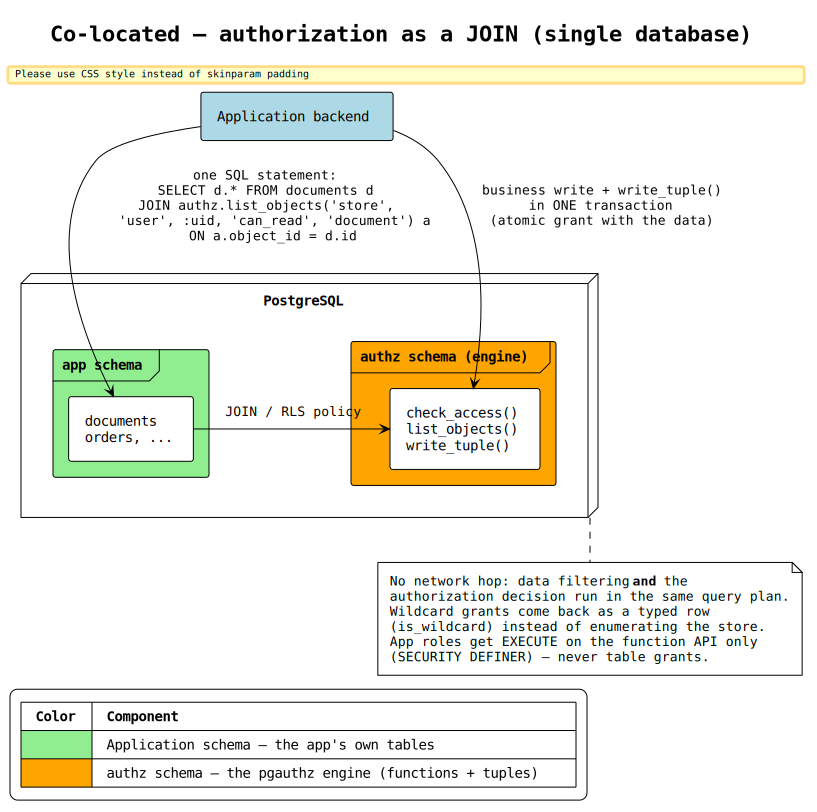
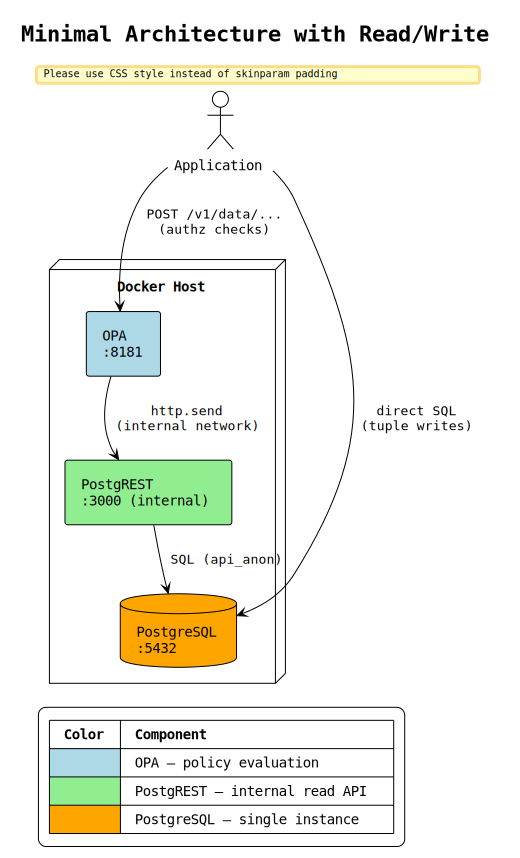
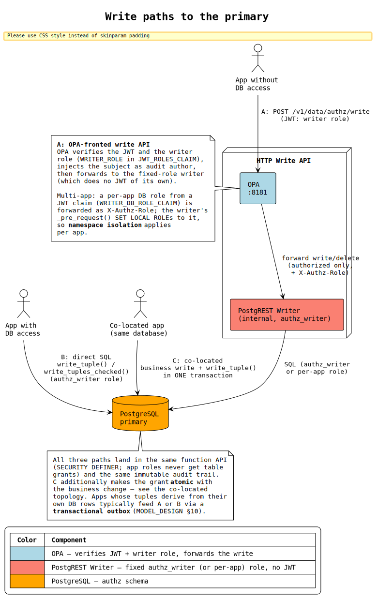
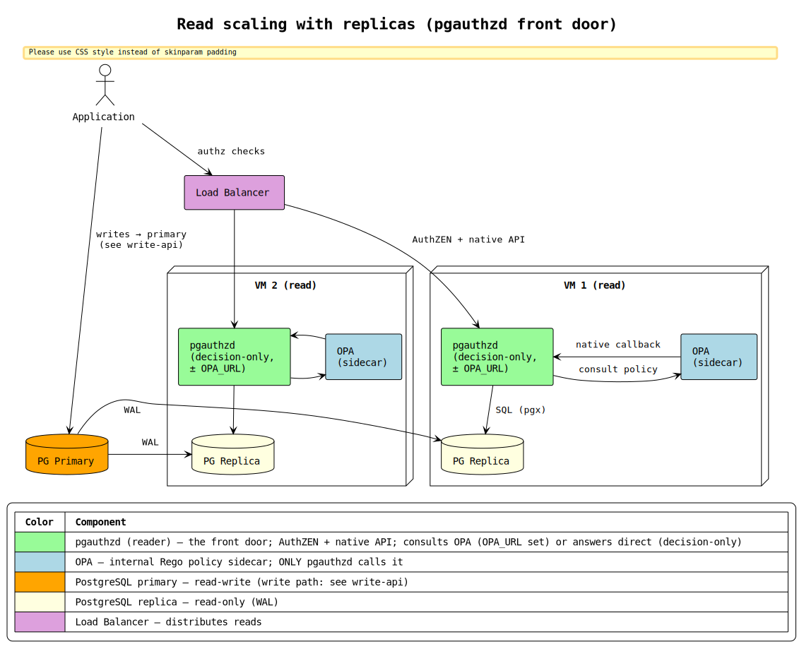
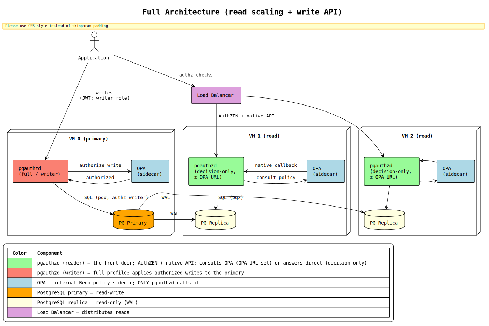
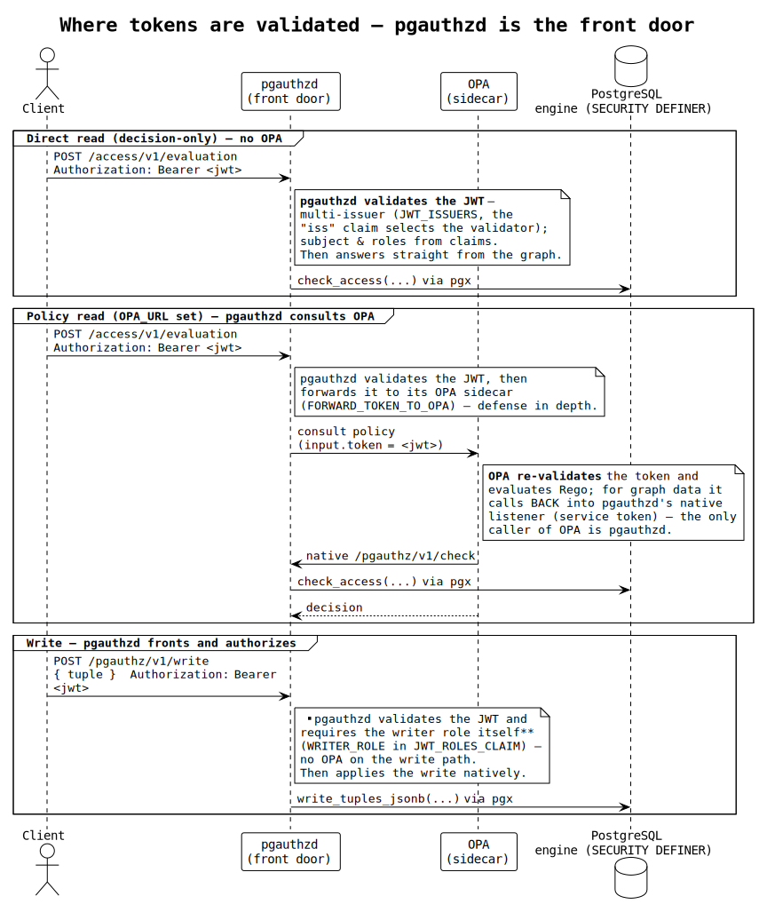

# Architecture Documentation

arc42-based architecture documentation for the PostgreSQL Authorization
Engine — a pure SQL implementation of Google Zanzibar / OpenFGA
relationship-based access control (ReBAC).

---

## 1. Introduction and Goals

### Purpose

The authorization engine answers the question **"Can user X do action Y
on resource Z?"** entirely inside PostgreSQL. It evaluates relationship
tuples and model rules recursively — no external authorization service
is required for the core engine.

Applications write relationship facts ("alice is a member of
payroll_team") and the engine derives permissions from these facts
using three rule types: direct, computed, and tuple-to-userset (TTU).

### Quality Goals

| Priority | Goal | Scenario |
|---|---|---|
| 1 | **Security** | A compromised application role cannot bypass SECURITY DEFINER to read tuples directly. A malicious condition expression cannot access any table or function. |
| 2 | **Performance** | `check_access` resolves in sub-millisecond for typical 3-5 level hierarchies with integer ID encoding, partition pruning, and covering indexes. |
| 3 | **Auditability** | Given a compliance inquiry, reconstruct who had what permissions at any past timestamp via time-travel queries against the immutable audit log. (Scope: the log versions tuples, model rules, and condition expressions; checks reconstruct all three as of T.) |
| 4 | **Operability** | New developer runs the full system with tests in under 5 minutes via `bootstrap.sh`. No external runtime dependencies beyond PostgreSQL. |
| 5 | **Compatibility** | Existing OpenFGA models and tuples can be imported directly. AuthZEN 1.0 API (evaluation, batch, search) via Go services. |

### Stakeholders

| Role | Expectations |
|---|---|
| Application developers | SQL or REST API for permission checks and tuple management. Clear error messages. |
| Security / compliance teams | Immutable audit trail, time-travel queries, access explanation (`explain_access`). |
| Platform / operations | Docker Compose deployment, horizontal read scaling via replicas, monitoring via standard PostgreSQL tooling. |
| Authorization model designers | Familiar Zanzibar/OpenFGA concepts, OpenFGA model import, `explain_access` for debugging. |

---

## 2. Constraints

### Technical

| Constraint | Rationale |
|---|---|
| PostgreSQL 18+ | Uses `GENERATED ALWAYS AS IDENTITY`, `CREATE INDEX ... INCLUDE`, `gen_random_uuid()`, and LIST/HASH/RANGE partitioning features. |
| Pure SQL | All authorization logic lives in PL/pgSQL functions. No external runtime, no compiled extensions. |
| Docker Compose | Default deployment target. OPA and PostgREST run as sidecars in the same compose stack. |
| No gRPC / SDK | Integration via SQL, REST (PostgREST), or AuthZEN 1.0 (Go services). No client libraries or language-specific SDKs. |

### Organizational

| Constraint | Rationale |
|---|---|
| Zanzibar/OpenFGA compatibility | The modeling baseline — users should recognize the concepts (tuples, computed relations, TTU). |
| Multi-application isolation | Multiple applications share a single authz database. Namespace-based access control isolates tuple management per application. |

### Conventions

| Convention | Rationale |
|---|---|
| Models as data | Authorization models are rows in tables, not DDL. Model changes are data operations that take effect immediately. |
| SECURITY DEFINER boundary | All public functions run as schema owner. Application roles never have direct table access. |
| Immutable audit trail | Every tuple INSERT/DELETE is trigger-logged. Audit records are never updated or deleted during normal operation. |

---

## 3. Context and Scope

### System Context

```
                                      ┌──────────────────────────────────────┐
                                      │      Authorization Engine            │
                                      │                                      │
  ┌────────────┐  authz check         │  ┌──────────┐    ┌──────────────────┐│
  │            │  (HTTP + JWT)        │  │   OPA    ├───►│   PostgREST      ││
  │ Application├─────────────────────►│  │ (policy) │    │ (REST-to-SQL)    ││
  │  Backend   │                      │  └────┬─────┘    └────────┬─────────┘│
  │            │  direct SQL (writes) │       │                   ▼          │
  │            ├─────────────────────►│       │          ┌──────────────────┐│
  └─────┬──────┘                      │       │          │   PostgreSQL     ││
        │                             │       │          │    (engine)      ││
        │ obtains JWT                 │       │          └──────────────────┘│
        ▼                             │       │                              │
  ┌────────────┐                      │       │                              │
  │  Identity  │◄──── fetch JWKS ─────┼───────┘                              │
  │  Provider  │      (OPA pulls)     │                                      │
  │ (Keycloak) │                      └──────────────────────────────────────┘
  └────────────┘
```

### External Interfaces

| Interface | Protocol | Direction | Purpose |
|---|---|---|---|
| OPA API | HTTP POST `:8181` | Inbound | Policy evaluation (access checks, search) |
| AuthZEN Direct | HTTP `:8090` | Inbound | AuthZEN 1.0 API — Go→PostgreSQL (lowest latency) |
| AuthZEN OPA | HTTP `:8091` | Inbound | AuthZEN 1.0 API — Go→OPA (policy-enriched) |
| PostgREST Writer | HTTP POST (internal) | Inbound (from OPA only) | Tuple management — OPA forwards authorized writes; fixed `authz_writer` role, no host port |
| PostgreSQL | TCP `:5432` | Inbound | Direct SQL access for applications |
| Identity Provider | JWKS (HTTP) | Outbound (OPA, AuthZEN) | JWT verification key fetching |

The engine is a **sink** — the core PostgreSQL component makes no
outbound calls. OPA and the AuthZEN services fetch JWKS from the
identity provider.

### Deployment Topologies

Four topologies are supported. Diagrams are rendered from the `.puml`
sources next to this file (regenerate with
[`scripts/gen-diagrams.sh`](../scripts/gen-diagrams.sh)).

1. **Co-located** — the engine lives in the *application's* PostgreSQL
   database: authorization is a JOIN (or RLS policy) in the same query plan
   as the data, and a grant commits atomically with the business write.
   pgauthz's headline pattern for apps that already run Postgres.

   
   ([source](architecture-colocated.puml))

2. **Minimal** — single Docker host with OPA + PostgREST + PostgreSQL.
   Writes go directly to PostgreSQL via SQL.

   
   ([source](architecture-minimal.puml))

3. **With Write API** — adds an OPA-fronted PostgREST writer for
   HTTP-based tuple management, plus the AuthZEN Go API layer (reads).
   The diagram shows all three ways writes reach the primary:
   **A** — through OPA (verifies the JWT + writer role, injects the audit
   author, forwards to the fixed-role writer; per-app namespace isolation
   via a `WRITER_DB_ROLE_CLAIM` → `X-Authz-Role` role switch);
   **B** — direct SQL (`write_tuple` / `write_tuples_checked` under an
   `authz_writer`-granted role); **C** — co-located, where the business
   write and the tuple write commit in one transaction. All three land in
   the same `SECURITY DEFINER` function API and audit trail.

   
   ([source](architecture-write-api.puml))

4. **Scaled** — load balancer distributes reads across multiple
   OPA + PostgREST + replica nodes. The LB exposes **two API surfaces**:
   the OPA data API (`/v1/data/authz/*`) for policy-native callers, and
   the standard AuthZEN 1.0 API (`/access/v1/*`) for interoperable PEPs —
   the AuthZEN service reaching PostgreSQL either directly
   (`authzen-direct`, lowest latency) or through OPA (`authzen-opa`,
   policy-enriched). Writes go to the primary — either directly via SQL:

   
   ([source](architecture-read-scaled.puml))

   or through the primary's OPA-fronted writer:

   
   ([source](architecture-full.puml))

---

## 4. Solution Strategy

### Key Architectural Decisions

| Decision | Quality Goal | Rationale |
|---|---|---|
| Pure PostgreSQL implementation | Operability | No external authorization service to deploy, monitor, or version. The database is the single source of truth. |
| SECURITY DEFINER functions | Security | Application roles have zero table access. The function API is the only entry point, making the table schema an internal implementation detail. |
| Integer ID encoding | Performance | `smallint` IDs (2 bytes) instead of text for types/relations. Smaller rows, faster comparisons, better cache hit ratio. |
| LIST partitioning by object_type | Performance | Each type gets its own partition. `check_access` benefits from partition pruning — only the relevant partition is scanned. |
| Three-tier HTTP stack (OPA + PostgREST + PG) | Compatibility | OPA provides policy-as-code with JWT authentication and caching. PostgREST maps SQL functions to REST endpoints. Both are optional. |
| Models as data, not schema | Operability | Model changes are INSERT/DELETE operations. No schema migrations, no function reloads, no downtime. |
| Condition sandboxing via `authz_eval` | Security | User-defined SQL expressions run under a role with zero grants (no table/file/function access). Bounded in time by a `statement_timeout` on the service roles (timeout fails closed); `pg_sleep` revoked from PUBLIC. Evaluation errors fail closed (deny). |
| Multi-store isolation | Operability | Independent authorization namespaces enable blue-green model deployment, test environments, and parallel experiments. |
| Immutable audit trail | Auditability | Trigger-based capture of every tuple change. Monthly RANGE partitioning for retention. Time-travel queries reconstruct past permission states. |
| OPA fronts the writer | Security | The writer runs as a fixed `authz_writer` role with no JWT and no host port; OPA verifies the token + writer role and forwards the write. One front door for reads and writes — no schema-leaking PostgREST endpoint is exposed, and `jwks_uri` rotation lives in a single place. |

### Technology Choices

| Technology | Role | Why |
|---|---|---|
| PostgreSQL 18 | Authorization engine | Recursive PL/pgSQL, advanced partitioning, `SECURITY DEFINER`, `gen_random_uuid()` |
| PostgREST | REST-to-SQL bridge | Zero-code HTTP API from SQL functions, role-scoped connections, connection pooling |
| OPA (Rego) | Policy decision point + write front door | JWT verification, response caching, policy-as-code, composable rules; forwards authorized writes |
| Go (AuthZEN) | Standard authorization API | AuthZEN 1.0 endpoints (evaluation, batch, search). Two variants: direct→PG and via→OPA |
| Docker Compose | Deployment | Single-command setup for development and production |

---

## 5. Building Block View

### Level 1: System Decomposition

```
┌────────────────────────────────────────────────────────────────────┐
│                        Authorization System                        │
│                                                                    │
│  ┌──────────────────┐   authzen-opa  ┌────────────┐                │
│  │  AuthZEN API     ├───────────────▶│    OPA     │  single front  │
│  │ (Go, AuthZEN 1.0)│                │  (policy)  │  door for      │
│  │                  │                └──┬──────┬──┘  reads+writes   │
│  │                  │            reads  │      │  writes (authz'd)  │
│  │                  │           ┌───────▼──┐ ┌─▼───────────────┐    │
│  │                  │           │PostgREST │ │ PostgREST       │    │
│  │                  │           │(read,    │ │ (writer,        │    │
│  │  authzen-direct  │           │ api_anon)│ │  authz_writer)  │    │
│  └────────┬─────────┘           └───────┬──┘ └─┬───────────────┘    │
│           │ SQL (direct)                │      │                    │
│           └──────────────┐    ┌─────────▼──────▼──┐                 │
│                          └───▶│    PostgreSQL     │                 │
│                               │   authz schema    │                 │
│                               └───────────────────┘                 │
└────────────────────────────────────────────────────────────────────┘
```

| Component | Responsibility |
|---|---|
| **AuthZEN API** | Standard AuthZEN 1.0 HTTP endpoints (Go). Two variants: `authzen-direct` (Go→PG) and `authzen-opa` (Go→OPA). JWT verification — **multi-issuer** via `JWT_ISSUERS` (the token's `iss` selects the validator; legacy single-issuer envs still work). Reverse-search endpoints optionally role-gated (`SEARCH_REQUIRED_ROLE` + `JWT_ROLES_CLAIM`). `authzen-opa` can forward the verified token to OPA (`FORWARD_TOKEN_TO_OPA`) so OPA re-validates it instead of trusting a forwarded subject. |
| **OPA** | Single front door (reads + writes). Policy evaluation, JWT verification, response caching, endpoint security. Forwards authorized writes to the writer. |
| **PostgREST (read)** | Maps SQL functions to REST. Runs as `api_anon` (inherits `authz_reader`). Internal only — no host port. |
| **PostgREST (writer)** | Receives OPA-forwarded tuple writes. Runs as a fixed `authz_writer` role; does **no** JWT verification of its own. Internal only — no host port. |
| **PostgreSQL** | The authorization engine. All logic in PL/pgSQL functions within the `authz` schema. |

### Level 2: PostgreSQL `authz` Schema

#### Tables

| Table | Purpose | Partitioning |
|---|---|---|
| `stores` | Independent authorization namespaces | — |
| `types` | Object type registry (smallint ID, namespace) | — |
| `relations` | Relation registry (smallint ID) | — |
| `conditions` | Named SQL expressions for ABAC | — |
| `conditions_audit` | Immutable condition-expression change log (versions conditions for time-travel) | — |
| `models` | Authorization rules (direct/computed/TTU, groups). PK + unique index. | — |
| `models_audit` | Immutable model-rule change log (versions the model for time-travel) | — |
| `namespace_access` | Per-namespace role grants (read/write) | — |
| `tuples` | Relationship facts (the core data) | LIST by `object_type`, optional HASH sub-partitioning |
| `tuples_audit` | Immutable tuple change log | RANGE by `performed_at` (monthly) |

#### Indexes

| Index | Pattern | Strategy |
|---|---|---|
| `idx_tuples_direct` | Direct tuple lookup (hot path) | Partial (`WHERE user_relation IS NULL`) |
| `idx_tuples_userset` | Userset expansion | Covering (`INCLUDE user_type, user_id, user_relation`) |
| `idx_tuples_user` | Reverse lookup (`list_objects`) | Covering index |

#### Public API Functions

**Access checks:**
- `check_access` — basic permission check
- `check_access_with_context` — with request context for conditions
- `check_access_with_contextual_tuples` — with ephemeral tuples
- `check_access_batch` / `check_access_batch_typed` — batch evaluation with semantics

**Search (AuthZen):**
- `list_objects` — which objects can a user access?
- `list_subjects` — who can access an object?
- `list_actions` — what can a user do on an object?

**Write operations:**
- `write_tuple` / `delete_tuple` — single tuple
- `write_tuples` / `delete_tuples` — batch
- `delete_user_tuples` — offboarding (remove all tuples for a user)

**Audit and debugging:**
- `audit_list_user` / `audit_list_object` — change history
- `audit_check_access` / `audit_list_actions` — time-travel
- `explain_access` — full resolution trace with timing, incl. the exact
  granting tuple per step (`matched_tuple`, redacted in safety mode)
- `validate_condition` — test condition expressions

**Watch / changefeed:**
- `watch_changes` — stream tuple changes since a cursor (lag-gated; pairs with `NOTIFY authz_changes`)
- `watch_cursor` — the store's current high-water cursor

**Administration:**
- `create_store` / `retire_store` (soft-delete) / `delete_store` — store lifecycle
- `model_register_type` / `model_register_relation` — model evolution
- `model_add_rule` / `model_remove_rule` / `model_remove_rules` — incremental model management
- `import_openfga_model` / `import_openfga_tuples` — OpenFGA import
- `model_add_type_restriction` / `model_remove_type_restriction` / `model_remove_type_restrictions` — type restriction management
- `grant_namespace_access` / `revoke_namespace_access` — namespace management
- `find_redundant_tuples` — detect tuples covered by other rules
- `cleanup_redundant_tuples` — remove redundant tuples (dry-run by default)

#### Internal Functions

| Function | Purpose |
|---|---|
| `_s`, `_t`, `_r` | Name → ID resolution (store, type, relation) |
| `_check_access` | Recursive access resolution engine |
| `_eval_rule` | Rule dispatcher (direct/computed/TTU) |
| `_eval_direct` | Direct tuple matching with userset expansion |
| `_eval_ttu` | Tuple-to-userset traversal |
| `_eval_condition` / `_exec_condition` | Condition evaluation (sandboxed) |
| `_check_namespace_access` | Namespace-based access enforcement |
| `_check_type_restriction` | Subject type restriction enforcement on writes |
| `_ensure_tuple_partition` | On-demand partition creation |
| `_audit_tuple` | Audit trigger function |

#### Roles

```
                ┌── authz_auditor ──┐
api_anon ── authz_reader            ├── authz_admin
                └── authz_writer ───┘
```

| Role | Grants | Purpose |
|---|---|---|
| `authz_eval` | Zero grants | Sandboxed condition evaluation |
| `api_anon` | Inherits `authz_reader` | PostgREST anonymous role |
| `authz_auditor` | Reader + `audit_*` functions | Compliance / security teams |
| `authz_reader` | `check_access`, `list_*`, `explain_access` | Read-only access checks |
| `authz_contextual_reader` | `check_access_with_contextual_tuples*` | Contextual-tuple checks (inject ephemeral tuples) — trusted PDP callers only; granted to no one by default |
| `authz_writer` | Reader + `write_tuple`, `delete_tuple`, batch ops | Application backends |
| `authz_admin` | Writer + auditor + store/model management | Full administrative control |
| `app_readonly` | Inherits `authz_reader` (LOGIN) | Test user for read-only integration testing |
| `app_readwrite` | Inherits `authz_writer` (LOGIN) | Test user for read/write integration testing |
| `app_auditor` | Inherits `authz_auditor` (LOGIN) | Test user for audit integration testing |

### Level 2: OPA Policies

All policy files are flat under `opa/policies/`. Configuration is
externalized via environment variables on the OPA service (see
Deployment View).

| File | Package | Responsibility |
|---|---|---|
| `pgauthz.rego` | `authz.pgauthz` | Client library — wraps the PostgREST read calls (cached) and the writer's `write_tuple` / `delete_tuple` forwarders |
| `pgauthz_config.rego` | `authz.pgauthz.config` | PostgREST reader + writer URLs, cache TTL, default store (from env vars) |
| `policy.rego` | `authz` | Read policy (`allow`, `evaluations`, `accessible_objects`, `accessible_subjects`, `permitted_actions`). Subject search has its own guard (`_subject_search_valid`): it authorizes the **caller** (valid token, or trusted-PEP mode) — the subject is the search *result*, not an input |
| `write.rego` | `authz` | Write policy (`write`) — verifies the JWT + writer role, then forwards `write`/`delete` to the writer (injecting the subject as audit author) |
| `authn.rego` | `authn` | JWT verification + claim extraction (subject, roles via the configurable claim path) |
| `authn_config.rego` | `authn.config` | Issuer / audience, roles-claim path (`JWT_ROLES_CLAIM`), writer role (`WRITER_ROLE`) — from env vars |
| `system_authz.rego` | `system.authz` | OPA API endpoint security (admin token gating) |

---

## 6. Runtime View

The trust model across the three request paths — **where the JWT is
validated on each hop** (OPA front door, AuthZEN with token-forwarding,
and the OPA-fronted writer):


([source](architecture-token-flow.puml))

### Scenario 1: Access Check (Read Path)

```
Application           OPA              PostgREST          PostgreSQL
    │                  │                   │                   │
    │ POST /v1/data/   │                   │                   │
    │  authz/allow     │                   │                   │
    │─────────────────▶│                   │                   │
    │                  │ POST /rpc/        │                   │
    │                  │  check_access     │                   │
    │                  │──────────────────▶│                   │
    │                  │                   │ SELECT authz.     │
    │                  │                   │  check_access()   │
    │                  │                   │──────────────────▶│
    │                  │                   │                   │──┐
    │                  │                   │                   │  │ _check_access()
    │                  │                   │                   │  │ recursive
    │                  │                   │                   │  │ resolution
    │                  │                   │                   │◀─┘
    │                  │                   │     true/false    │
    │                  │                   │◀──────────────────│
    │                  │   true/false      │                   │
    │                  │◀──────────────────│                   │
    │ {"result": true} │                   │                   │
    │◀─────────────────│                   │                   │
```

### Scenario 2: Internal Resolution (`_check_access`)

When checking "Can alice read document:doc_payroll_001?":

1. Resolve store/type/relation names to integer IDs (`_s`, `_t`, `_r`)
2. Check namespace access for the target object type
3. Load all model rules for `(store, document, can_read)` in one query
4. Evaluate rules by group (OR between groups):
   - **Direct:** index scan on `idx_tuples_direct` for exact match + wildcard
   - **Computed:** recursive `_check_access` for aliased relation on same object
   - **TTU:** find linked objects via stored tuples, then `_check_access` on linked object
5. For direct matches with conditions: evaluate via `_exec_condition` (sandboxed)
6. For userset tuples: expand group membership recursively
7. Short-circuit on first `true` result

Maximum recursion depth: 32 levels by default, configurable via the
`authz.max_depth` GUC (see DESIGN.md). Exceeding it raises; cycles are
pruned independently.

### Scenario 3: Tuple Write (Write Path)

```
Application             OPA              PostgREST Writer    PostgreSQL
    │                    │                     │                │
    │ POST /v1/data/     │                     │                │
    │  authz/write       │                     │                │
    │  + JWT (writer)    │                     │                │
    │───────────────────▶│                     │                │
    │                    │ verify JWT,         │                │
    │                    │ require writer role │                │
    │                    │ forward /rpc/       │                │
    │                    │  write_tuple        │                │
    │                    │────────────────────▶│ (anon role =   │
    │                    │                     │  authz_writer) │
    │                    │                     │ SELECT authz.  │
    │                    │                     │  write_tuple(  │
    │                    │                     │  performed_by  │
    │                    │                     │  = subject)    │
    │                    │                     │───────────────▶│
    │                    │                     │                │──┐ INSERT tuple
    │                    │                     │                │  │ trigger: _audit_tuple()
    │                    │                     │                │  │ INSERT audit (author=subject)
    │                    │                     │                │◀─┘
    │                    │      200 OK         │                │
    │                    │◀────────────────────│                │
    │  {"allowed":true,  │                     │                │
    │   "result":{...}}  │                     │                │
    │◀───────────────────│                     │                │
```

### Scenario 4: Time-Travel Query

1. Caller invokes `audit_check_access(store, user, relation, object, timestamp)`
2. Engine queries `tuples_audit`, `models_audit`, **and `conditions_audit`** for all events up to the target timestamp
3. Replays each into a temp table — the last event per tuple / model rule / condition wins (ties broken by `seq`), keeping only those whose last event was an `INSERT`
4. Runs the snapshot check against the reconstructed tuples, model (`_snapshot_models`), **and condition expressions** (`_snapshot_conditions`), so all reflect time T
5. Drops the temp tables at transaction end

### Scenario 5: Error Handling

The engine is **fail-closed** throughout:

| Condition | Behavior |
|---|---|
| Unknown store/type/relation name | `RAISE EXCEPTION` — immediate error (user/object IDs are data and are not validated) |
| Namespace access denied | `RAISE EXCEPTION` — "Permission denied" |
| Condition evaluation error | Caught by `_exec_condition`, treated as `false` (deny) |
| Recursion depth exceeded (default 32, `authz.max_depth` GUC) | `RAISE EXCEPTION` — the relationship chain is too deep to resolve (matches OpenFGA's "resolution too complex") |
| Cyclic relationships | Edge revisiting a node on the current evaluation path is pruned — a cycle cannot grant access, and evaluation always terminates |
| No matching model rules | Return `false` (deny) |
| OPA: missing/invalid token on write | `{"allowed": false, "error": "not_authorized"}` |
| OPA: token lacks the configured writer role | `{"allowed": false, "error": "not_authorized"}` |
| OPA: writes disabled (no writer configured) | `{"allowed": false, "error": "writes_disabled"}` |

---

## 7. Deployment View

### Docker Compose Services

```
┌──────────────────────────────────────────────────────────────────────┐
│ Docker Host                                                          │
│                                                                      │
│  ┌─────────────────┐  ┌─────────────────┐                            │
│  │ AuthZEN Direct  │  │ AuthZEN OPA     │                            │
│  │ :8090           │  │ :8091           │                            │
│  └────────┬────────┘  └────────┬────────┘                            │
│           │ SQL (pgx)          │ HTTP                                │
│           │            ┌───────▼────────┐                            │
│           │            │ OPA :8181      │  (single front door:       │
│           │            │                │   reads AND writes)        │
│           │            └──┬──────────┬──┘                            │
│           │       reads   │          │  writes (authorized)          │
│           │       ┌───────▼──┐   ┌───▼────────────┐                  │
│           │       │ PostgREST│   │ PostgREST      │                  │
│           │       │ :3000    │   │ (writer, int.) │                  │
│           │       │ (reader) │   │ authz_writer   │                  │
│           │       └───────┬──┘   └───────┬────────┘                  │
│           │               │              │                           │
│  ┌────────▼───────────────▼──────────────▼─────────────────────────┐  │
│  │ PostgreSQL :5432 (host :55433) — authz schema                  │  │
│  └────────────────────────────────────────────────────────────────┘  │
└──────────────────────────────────────────────────────────────────────┘
```

OPA is the single front door for **both** reads and writes. The reader and
writer are separate PostgREST instances bound to separate DB roles
(`authz_reader` vs `authz_writer`), so the read path is structurally incapable
of writing. The writer has no host port — only OPA reaches it. For a read-only
deployment, omit the writer and leave `POSTGREST_WRITER_URL` unset (OPA's write
rule then returns `writes_disabled`).

| Service | Image | Ports | Notes |
|---|---|---|---|
| `authz-db` | `postgres:18.4` | 55433:5432 | `max_connections=250`, tuned `shared_buffers`, `work_mem` |
| `postgrest` | `postgrest/postgrest:v14.13` | 3000 (internal) | Read-only, `api_anon` role, pool=100 |
| `opa` | `openpolicyagent/opa:1.17.1` | 8181:8181 | Single front door (reads + writes). Token auth + basic authorization. Env: `JWT_ISSUER`, `JWT_AUDIENCE`, `DEFAULT_STORE`, `POSTGREST_URL`, `POSTGREST_WRITER_URL`, `JWT_ROLES_CLAIM`, `WRITER_ROLE`, `REQUIRE_TOKEN_FOR_READS` (tokenless `input.subject` reads only when `false` — trusted-PEP mode; the keycloak overlay pins `true`), `DEFAULT_CACHE_TTL_SECONDS`. |
| `postgrest-writer` | `postgrest/postgrest:v14.13` | internal only | Fixed `authz_writer` role, **no JWT** (OPA-fronted), pool=20; reachable only by OPA |
| `authzen-direct` | `authzen` (multi-stage) | 8090:8080 | AuthZEN 1.0 API, Go→PostgreSQL direct (via `compose-authzen.yml`) |
| `authzen-opa` | `authzen` (multi-stage) | 8091:8080 | AuthZEN 1.0 API, Go→OPA (via `compose-authzen.yml`). Extra env: `JWT_ISSUERS` (multi-issuer), `SEARCH_REQUIRED_ROLE` + `JWT_ROLES_CLAIM` (role-gated search), `FORWARD_TOKEN_TO_OPA` (OPA re-validates the token) |

### Scaled Deployment

```
                    ┌──────────────┐
                    │ Load Balancer│
                    └──────┬───────┘
                           │
              ┌────────────┼────────────┐
              ▼            ▼            ▼
     ┌────────────┐ ┌────────────┐ ┌────────────┐
     │ VM 1 (read)│ │ VM 2 (read)│ │ VM 0 (prim)│
     │ OPA        │ │ OPA        │ │ OPA (write)│
     │ PostgREST  │ │ PostgREST  │ │ PG Writer  │
     │ PG Replica │ │ PG Replica │ │ PG Primary │
     └────────────┘ └────────────┘ └────────────┘
           ▲               ▲              │
           └───────────────┴── WAL ───────┘
```

- **Read path:** load balancer distributes OPA read requests across replica nodes
- **Write path:** applications send writes to the primary's OPA, which verifies
  the JWT + writer role and forwards to the co-located writer (→ PG primary)
- **Replication lag:** typically sub-second for streaming replication

#### Consistency tokens (zookies): why not, yet

Reads on the **primary** are read-your-writes (MVCC) — *given a fresh snapshot*:
a new transaction, and no caller-side cache returning the pre-change state (a
long-running `REPEATABLE READ` transaction, or an OPA cache hit, can still serve
the old decision on the primary). Replicas are eventually consistent, bounded by
replication lag. The security-relevant case is a **stale allow after a revoke**.
Route-to-primary is the default recommendation; a first-class revision-token API
is **deferred, not rejected**:

- **A revoke is broader than the confirming check.** Given the heavy read:write
  ratio, checks that must reflect a just-made change can be routed to the primary
  at low latency. But after revoking Bob it is not enough to route the admin's
  *confirming* check to the primary — Bob's own later requests may keep hitting
  replicas. The options are: route the affected subject's sensitive actions to
  the primary, propagate a freshness token to causally-related checks,
  temporarily pin those requests to the primary, or serve from replicas covered
  by `synchronous_commit = remote_apply` (which only protects the standbys named
  in the synchronous set). A revision token earns its keep only when you want to
  keep serving even post-write checks from a replica — **not yet justified for
  the expected single-primary + read-replica deployment**, and it pushes real
  complexity onto clients (capture a token on write, thread it onto the right
  later check).

- **A WAL LSN cannot be a sound single-RPC zookie.** `pg_current_wal_lsn()`
  read *inside* `write_tuple`'s transaction is **pre-commit** (call it X); the
  commit record lands later at Y, with arbitrary interleaved WAL (own + concurrent
  transactions) between them. A replica only exposes the write once it replays
  the COMMIT at Y (MVCC), so a `replay_lsn ≥ X` test false-positives — in a busy
  system `replay_lsn` crosses X almost instantly from *unrelated* traffic, before
  Y. A sound token must be `≥ Y`: captured *after* the write commits, via
  `pg_current_wal_insert_lsn()` on the primary (the *insert* LSN — the write LSN
  can lag under asynchronous commit). A single PostgREST RPC can't return that
  after its own transaction commits — so it's not the cheap win it first appears.

- **A staleness gauge must compare against the primary.** Received-but-not-yet-
  applied lag alone —
  `pg_wal_lsn_diff(pg_last_wal_receive_lsn(), pg_last_wal_replay_lsn())` — reads
  ≈0 for a **disconnected** replica where both LSNs stop advancing, even when it
  is minutes behind; `pg_last_xact_replay_timestamp()` is likewise ambiguous when
  the primary is idle. A robust freshness monitor compares the **primary's**
  current LSN to the replica's replay LSN (read `pg_stat_replication` on the
  primary, or replicate a periodic heartbeat row) — not just the replica's local
  receive-vs-replay delta.

**If/when replica-offloaded *fresh* reads are required**, the preferred design is
an application-level **per-store monotonic revision** rather than leaking WAL
LSNs into the API (PostgreSQL-native, works for physical *and* logical replicas,
fits one write RPC):

- A `store_revisions(store_id, epoch, revision)` row. Every authorization write
  takes `SELECT … FOR UPDATE` on its store's row, applies the
  tuple/model/condition change, sets `revision = revision + 1`, returns it, and
  commits before acking the client. Writes for one store serialize (acceptable
  given write ≪ read — but benchmark it); revision order matches commit order, so
  a snapshot that sees revision R sees exactly the changes through R.
- The write RPC returns an opaque, **signed** token `{epoch, store, revision}`
  (signing stops a client manufacturing a huge future revision to force expensive
  waits). Checks take a `consistency` mode: `minimize_latency` (replica — today's
  behaviour), `at_least_as_fresh(token)` (replica only if its
  `current_revision ≥ token.revision`, else retry another replica / the primary),
  or `fully_consistent` (primary). The `epoch` invalidates tokens across a
  failover/restore so a stale token can't match a rewound revision.
- **OPA caching is part of the contract:** a fresh replica is meaningless if OPA
  serves an older cached allow — token-constrained / fully-consistent requests
  must bypass the cache (or key it by evaluated revision). When a replica can't
  satisfy the token within a short timeout, **fall back to the primary**, else
  fail closed (`replica_not_fresh_enough`) — never silently evaluate an older
  revision.

(This forward design follows an external consistency review, and mirrors
Zanzibar's contract: *evaluate against a snapshot at least as fresh as
revision R*.)

### PostgreSQL Tuning

| Parameter | Value | Rationale |
|---|---|---|
| `max_connections` | 250 | Supports 100 PostgREST read + 20 writer + headroom |
| `shared_buffers` | 256MB | Caches tuple partitions and indexes |
| `effective_cache_size` | 768MB | Planner hint for OS page cache |
| `work_mem` | 16MB | Sort/hash operations in list queries |
| `random_page_cost` | 1.1 | Assumes SSD storage |

---

## 8. Crosscutting Concepts

### Security: Defense in Depth

Four independent security layers protect the authorization data:

```
Layer 1: Network         OPA — the only front door (reads + writes); PostgREST internal-only
Layer 2: Authentication  JWT verification in OPA (and the AuthZEN services)
Layer 3: Authorization   PostgreSQL GRANT/REVOKE on functions (reader vs writer roles)
Layer 4: Data isolation  SECURITY DEFINER — no direct table access
```

**Condition sandboxing:** User-defined SQL expressions run under
`authz_eval`, a role with zero table and function grants (no data or host
access). A `statement_timeout` on the service roles bounds evaluation time
— a timed-out condition fails closed (the cancel aborts the check, never a
silent allow) — and `pg_sleep` is revoked from PUBLIC. Evaluation errors
are caught and treated as deny (fail-closed). See DESIGN.md for the full
capability/resource breakdown.

**Namespace isolation:** Object types can be assigned to namespaces.
The engine checks `session_user` membership in namespace-granted roles
before allowing reads or writes. Types with `namespace = NULL` remain
unrestricted.

### Application Integration Pattern

Applications should check authorization **before** fetching data —
fail fast, fail cheap. If the user cannot access a resource, avoid
the cost of downstream service calls or database queries.

```
Request → JWT validation → authz check → fetch data → business logic → response
                              ↓
                         403 (short-circuit)
```

For resources that require business-rule checks beyond the structural
permission (e.g., amount thresholds, document status), use a two-phase
approach:

1. **Structural check first** — call the authz engine to verify
   the relationship-based permission (`can_read`, `can_approve`).
   This is cheap and needs no application data.
2. **Business-rule check after fetch** — load the resource, then
   apply application-specific constraints (amount limits, workflow
   state, time windows not modeled as conditions).

This maps to the guidance in [DESIGN.md](DESIGN.md#where-to-put-permissions-authz-model-vs-application):
structural permissions in the authz engine, business rules in the
application.

Each service in the call chain should independently verify access
(defense in depth) rather than trusting the caller. The initial
service checking first avoids unnecessary network round-trips when
access is denied.

See [DEVELOPMENT.md](DEVELOPMENT.md#application-integration) for
concrete integration examples.

### Performance Optimizations

| Optimization | Impact |
|---|---|
| Integer IDs (smallint) | Smaller rows, faster comparisons, better cache ratio |
| LIST partitioning by object_type | Partition pruning — only scan relevant type |
| HASH sub-partitioning | Spread high-volume types across multiple tables |
| Partial indexes (direct vs userset) | Separate B-trees, more accurate planner estimates |
| Covering indexes (`INCLUDE`) | Index-only scans, no heap access |
| Single-query model fetch | One query loads all rules with group boundary detection |
| Condition short-circuit | Unconditional tuples checked before condition evaluation |
| Temp table reuse | `CREATE IF NOT EXISTS` + `TRUNCATE` avoids catalog churn |
| UUID audit IDs | `gen_random_uuid()` eliminates sequence serialization |

### Auditability

- **Immutable audit log:** trigger-based capture of every tuple change
- **Monthly RANGE partitioning:** efficient time-range queries, easy retention (`DROP PARTITION`)
- **`performed_by` tracking:** application-level user identity (distinct from DB role), transaction-local via `set_config`
- **Time-travel queries:** reconstruct permission state at any past timestamp by replaying the audit log
- **Transactional versioning:** audit rows carry the transaction timestamp (`transaction_timestamp()`), so all changes in one transaction share one version and time-travel applies a transaction's effect atomically — never a partial, mid-transaction state. The `seq` identity orders events that share a timestamp (last-write-wins replay). Group related changes in one transaction to give them one version
- **Audit suppression control:** only `authz_admin` can suppress audit logging (for maintenance operations)

### Testability

| Suite | Tests | Scope |
|---|---|---|
| `tests.sql` (demo model) | 18 | Demo model authorization checks |
| `tests_api.sql` | 48 | Write/delete, batch ops, audit, time-travel, model management |
| `tests_eval_rule.sql` | 26 | Rule evaluation unit tests (direct, TTU, tracing) |
| `tests_namespace.sql` | 23 | Namespace read/write enforcement |
| `tests_search.sql` | 20 | `list_objects`, `list_subjects`, `list_actions`, pagination |
| `tests_list_subjects.sql` | 11 | `list_subjects` reverse expansion across every mechanism |
| `tests_type_restrictions.sql` | 18 | Type restriction enforcement on writes |
| `tests_contextual.sql` | 15 | Conditions and contextual tuples |
| `tests_wildcard.sql` | 6 | Wildcard tuple matching |
| `tests_intersection.sql` | 3 | Intersection and exclusion groups |
| `tests/test-opa.sh` | 38 | OPA reads, OPA-fronted writes, + API security (integration) |
| `tests/test-authzen.sh` | 6 | AuthZEN API endpoints (integration) |

Each SQL test suite uses its own isolated store.

---

## 9. Architecture Decisions

### ADR-1: Pure PostgreSQL over External Authorization Service

**Context:** The system needs to answer permission queries with minimal
operational overhead. External services (SpiceDB, OpenFGA) add
deployment complexity, network latency, and a separate data store to
manage.

**Decision:** Implement the full Zanzibar model as PL/pgSQL functions
inside PostgreSQL.

**Consequences:** No additional services to deploy for the core engine.
Applications can call `check_access` directly via SQL. Trade-off: no
gRPC, no SDK ecosystem, no built-in consistency tokens (zookies).

### ADR-2: SECURITY DEFINER over Row-Level Security

**Context:** Application roles need to be prevented from reading or
modifying authorization tables directly.

**Decision:** All public functions are `SECURITY DEFINER` (run as the
schema owner). No direct table grants to any application role. The
schema owner is `authz_owner`, a **non-superuser** role, so definer
functions execute with table-ownership privileges only — never
superuser — limiting the blast radius of any flaw in the function layer.

**Consequences:** The table schema is an internal implementation detail
that can change freely. RLS is unnecessary — the function layer
enforces access control. All writes go through `write_tuple`/`delete_tuple`
which validate input, enforce namespaces, and fire audit triggers.

### ADR-3: Integer IDs for Type and Relation Names

**Context:** The `tuples` table is the hot path. Row size and index
efficiency directly affect performance.

**Decision:** Store type and relation names as `smallint` IDs (2 bytes).
The public API accepts text and resolves internally.

**Consequences:** Significantly smaller rows and indexes. One extra
lookup per API call (cached by buffer cache after first call).

### ADR-4: LIST Partitioning by Object Type

**Context:** `check_access` always targets a specific object type.
Without partitioning, every query scans the full tuples table.

**Decision:** LIST-partition `tuples` by `object_type`. Each type gets
its own partition. High-volume types can add HASH sub-partitioning.

**Consequences:** Partition pruning ensures only the relevant type's
partition is scanned. Adding a new type requires creating a new
partition (handled by `model_register_type`).

### ADR-5: Models as Data, Not Schema

**Context:** Authorization models evolve over time. Schema-based changes
require migrations and downtime.

**Decision:** Store model rules as rows in `authz.models`. Model changes
are INSERT/DELETE operations that take effect immediately.

**Consequences:** No schema migrations for model changes. The model
table has a primary key and unique index, enabling both full
replacement (`import_openfga_model`) and incremental updates
(`model_add_rule`, `model_remove_rule`). Full replacement is
transactional — PostgreSQL MVCC ensures concurrent readers see either
the complete old model or the complete new model, with no denial window.

### ADR-6: OPA Fronts the Writer (supersedes the Nginx write gateway)

**Context:** PostgREST exposes REST endpoints for all tables and leaks
function signatures in error responses (no built-in "RPC-only" mode), and
it can only verify a *static* JWK/JWKS — it cannot fetch a rotating
`jwks_uri`. Earlier versions placed an Nginx reverse proxy in front of the
writer that allowlisted `POST /rpc/*`.

**Decision:** Make OPA the single front door for writes as well as reads.
The writer PostgREST runs as a fixed `authz_writer` role, does no JWT
verification, and has no host port. OPA verifies the token, requires the
configured writer role (`WRITER_ROLE` within `JWT_ROLES_CLAIM`), and
forwards `write`/`delete` to the writer — injecting the authenticated
subject as the audit author. The Nginx gateway is removed.

**Consequences:** One place owns JWT verification and `jwks_uri` rotation
(no JWKS to sync into PostgREST). No write endpoint is host-exposed, so
there is no schema leakage to suppress and no extra proxy container. Tuple
writes only — admin/model ops use a separate `authz_admin` channel. A
read-only deployment omits the writer (and `POSTGREST_WRITER_URL`); OPA
then returns `writes_disabled`.

---

## 10. Quality Requirements

### Quality Tree

```
Quality
├── Security
│   ├── No direct table access (SECURITY DEFINER)
│   ├── Condition sandboxing (authz_eval role)
│   ├── Namespace isolation (per-type, per-role)
│   ├── Single front door (OPA verifies reads + writes)
│   └── Fail-closed on all errors
├── Performance
│   ├── Sub-millisecond check_access (typical graphs)
│   ├── Integer ID encoding
│   ├── Partition pruning
│   └── Covering index-only scans
├── Auditability
│   ├── Immutable audit trail
│   ├── Time-travel queries
│   └── Application user tracking (performed_by)
├── Operability
│   ├── Single-command setup (bootstrap.sh)
│   ├── Docker Compose deployment
│   ├── Horizontal read scaling (replicas)
│   └── Standard PostgreSQL monitoring
└── Compatibility
    ├── OpenFGA model import
    ├── AuthZen Search API
    └── Zanzibar concepts
```

### Quality Scenarios

| ID | Quality | Stimulus | Response | Measure |
|---|---|---|---|---|
| QS-1 | Security | Compromised app role attempts `SELECT * FROM authz.tuples` | Permission denied | 100% of direct table access attempts blocked |
| QS-2 | Security | Malicious condition: `(SELECT password FROM users)` | Condition evaluation fails, access denied | Zero data exfiltration |
| QS-3 | Performance | `check_access` on typical 3-5 level hierarchy | Returns true/false | < 1ms |
| QS-4 | Auditability | Compliance inquiry: "Who had access to doc X on March 1st?" | `audit_check_access` returns reconstructed state | Complete and accurate |
| QS-5 | Operability | New developer clones repo | Full system running with tests passing | < 5 minutes |
| QS-6 | Operability | Read traffic increases 5x | Add replica nodes behind load balancer | Linear read scaling |

---

## 11. Risks and Technical Debt

### Risks

| Risk | Probability | Impact | Mitigation |
|---|---|---|---|
| No consistency tokens (zookies) | Medium | With read replicas, an asynchronous replica can serve stale data after a write. The risk is a **stale allow after a revoke** (a lagging replica still returns `allowed`); a stale deny after a grant is only an availability hiccup. Reads on the primary are read-your-writes (MVCC) given a fresh snapshot | Route the affected subject's security-critical checks to the primary (not just the admin's confirming check — see the *Consistency tokens* section); lag is typically sub-second; serve from replicas under `synchronous_commit = remote_apply` to remove it for that synchronous set. A first-class freshness API is deferred — the documented forward path is a per-store signed **revision** token (`at_least_as_fresh` / `fully_consistent` modes), not a raw WAL LSN. See *Consistency tokens (zookies)* above and README → Consistency model |
| Recursion depth limit (default 32) | Low | Deeply nested models could hit the ceiling | Each schema layer costs 2-3 levels; 32 covers ~10 layers. Configurable via the `authz.max_depth` GUC (session or database level). Exceeding it raises; cycles are pruned independently. |
| No streaming push *transport* (WebSocket/SSE) | Low | Real-time UIs must bridge the changefeed themselves | The Watch changefeed exists — `authz.watch_changes` (cursored, lag-gated stream over `tuples_audit`) + a `NOTIFY authz_changes` doorbell. Only an HTTP streaming bridge (WebSocket/SSE) is left to the deployment; exactly-once consumers can use logical replication. |
| Condition expressions can fail on specific data at check time | Low | A `BEFORE INSERT/UPDATE` trigger test-compiles every condition expression in the sandbox and rejects it if it cannot compile (SQLSTATE class 42 — syntax error, unknown function/column/table, type mismatch), so malformed expressions never get stored. *Data-dependent* runtime errors (class 22, e.g. a cast that fails only on certain inputs) are not caught at write time | Those data-dependent failures are caught at check time and treated as deny (`_exec_condition` errors → false), so a condition is always fail-safe (it can deny, never wrongly grant). Time-travel needs request data beyond the reconstructed timestamp supplied via `audit_check_access(..., p_request_context)`. |
| `list_objects` degrades for all-access users | Low | `list_objects` uses reverse expansion: cost is O(the user's reachable set), independent of store size — measured ~140 ms against 1M objects for a grant-sparse user. For a user who can reach most of the store through many individual grants, the reachable set approaches the store size and the call degrades to O(all objects) | Model all-access roles as **object wildcards** (`object_id = '*'`, gated by `allow_object_wildcard` on the direct rule): checks and listing become O(1), with `list_objects` returning the typed `('*', is_wildcard)` row. Alternatively, authorize once and list from the application database |
| `list_subjects` degrades for all-shared objects | Low | `list_subjects` uses **upward reverse expansion** (the dual of `list_objects`): it walks from the object to its reachable subjects, so cost is O(the object's reachable subject set), independent of the store's user count — ~7 ms for a 3-grantee object in a 100k-user store (vs ~11 s for the old whole-store scan). For an object reachable by most of the user base through many individual grants, the candidate set approaches that population and the call degrades to O(those subjects) | Model public/all-user access as a **user wildcard** (`user_id = '*'`): checks and listing become O(1), with `list_subjects` returning the typed `('*', is_wildcard)` row. The expansion uses the same object-keyed indexes as the `check_access` hot path |
| PostgREST schema leakage | Low | Wrong parameter names reveal function signatures | Neither PostgREST instance is host-exposed — only OPA reaches them. OPA returns structured `{allowed, error}` responses rather than raw PostgREST errors. |

### Technical Debt

| Item | Severity | Notes |
|---|---|---|
| OPA creates new TCP connection per request | Low | `http.send` sets `DisableKeepAlives=true`. Mitigated by PostgREST connection pooling and cache TTL. |

### By-Design Limitations

These are intentional trade-offs, not technical debt:

- **No relation-to-object-type validation on writes** — tuples can be written for any registered `(relation, object_type)` pair even if no model rule references it. This allows seeding data before the model is loaded. Orphan tuples are harmless (never match) and `find_redundant_tuples` identifies waste. Subject type restrictions are enforced separately via `_check_type_restriction`.
- **No built-in model versioning** — multi-store isolation provides blue-green model deployment; `model_add_rule` / `model_remove_rule` handle incremental evolution
- **No gRPC / SDK ecosystem** — SQL and REST are the integration points
- **No distributed transactions** — writes go to one PostgreSQL instance
- **No built-in WebSocket/SSE transport** — the Watch changefeed (`watch_changes` + `NOTIFY authz_changes`) is available, but bridging it to browser push (WebSocket/SSE) is left to the deployment
- **No built-in rate limiting** — expected to be handled at the infrastructure layer (load balancer, Nginx)

---

## 12. Glossary

| Term | Definition |
|---|---|
| **ReBAC** | Relationship-Based Access Control — permissions derived from relationships between entities |
| **Zanzibar** | Google's global authorization system (2019 paper). The conceptual foundation for this engine. |
| **OpenFGA** | Open-source Zanzibar implementation by Auth0/Okta. Model format is import-compatible. |
| **Tuple** | A relationship fact: `(user_type, user_id) --relation--> (object_type, object_id)` |
| **Store** | An independent authorization namespace with its own types, relations, model rules, and tuples |
| **Direct rule** | A stored tuple directly grants the relation |
| **Computed rule** | An alias — having relation A on an object implies relation B on the same object |
| **TTU** | Tuple-to-Userset — follow a link to another object, then check a relation there |
| **Userset** | A tuple referencing a group via `user_relation` (e.g., `team:X#member`) |
| **Wildcard tuple** | `user_id = '*'` — grants a relation to all users of that type |
| **Condition** | A named SQL expression evaluated at check time for ABAC (time windows, IP ranges, quotas) |
| **Contextual tuple** | An ephemeral per-request relationship injected at check time, not persisted |
| **Rule group** | Rules sharing a `group_id` with a `group_op`: OR (default), intersection (AND), or exclusion (BUT NOT) |
| **Namespace** | Access control boundary for multi-application stores. Controls which DB roles can manage which object types. |
| **Partition pruning** | PostgreSQL optimization — only scan the partition matching the query's `object_type` value |
| **SECURITY DEFINER** | PostgreSQL function attribute — runs as the function owner, not the caller |
| **AuthZEN** | OpenID Foundation authorization API standard ([1.0 spec](https://openid.net/specs/authorization-api-1_0.html)). Two Go services expose evaluation, batch evaluation, and search endpoints. |
| **`performed_by`** | Application-level user identity recorded in audit entries (distinct from the database role) |
| **`explain_access`** | Debugging function that returns a JSON trace of every rule evaluation step with timing |

---

*This document follows the [arc42](https://arc42.org/) template for
software architecture documentation.*
