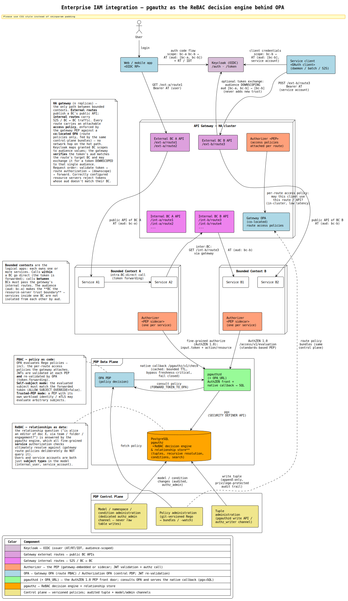

# Architecture Documentation

arc42-based architecture documentation for the PostgreSQL Authorization
Engine — a pure SQL implementation of Google Zanzibar / OpenFGA
relationship-based access control (ReBAC).

---

## 1. Introduction and Goals

### Purpose

The authorization engine answers the question **"Can user X do action Y
on resource Z?"** entirely inside PostgreSQL. It evaluates relationship
tuples and model rules recursively — no external authorization service
is required for the core engine.

Applications write relationship facts ("alice is a member of
payroll_team") and the engine derives permissions from these facts
using three rule types: direct, computed, and tuple-to-userset (TTU).

### Quality Goals

| Priority | Goal | Scenario |
|---|---|---|
| 1 | **Security** | A compromised application role cannot bypass SECURITY DEFINER to read tuples directly. A malicious condition expression cannot access any table or function. |
| 2 | **Performance** | `check_access` resolves in sub-millisecond for typical 3-5 level hierarchies with integer ID encoding, partition pruning, and covering indexes. |
| 3 | **Auditability** | Given a compliance inquiry, reconstruct who had what permissions at any past timestamp via time-travel queries against the immutable audit log. (Scope: the log versions tuples, model rules, and condition expressions; checks reconstruct all three as of T.) |
| 4 | **Operability** | New developer runs the full system with tests in under 5 minutes via `bootstrap.sh`. No external runtime dependencies beyond PostgreSQL. |
| 5 | **Compatibility** | Existing OpenFGA models and tuples can be imported directly. AuthZEN 1.0 API (evaluation, batch, search) via Go services. |

### Stakeholders

| Role | Expectations |
|---|---|
| Application developers | SQL or REST API for permission checks and tuple management. Clear error messages. |
| Security / compliance teams | Immutable audit trail, time-travel queries, access explanation (`explain_access`). |
| Platform / operations | Docker Compose deployment, horizontal read scaling via replicas, monitoring via standard PostgreSQL tooling. |
| Authorization model designers | Familiar Zanzibar/OpenFGA concepts, OpenFGA model import, `explain_access` for debugging. |

---

## 2. Constraints

### Technical

| Constraint | Rationale |
|---|---|
| PostgreSQL 18+ | Uses `GENERATED ALWAYS AS IDENTITY`, `CREATE INDEX ... INCLUDE`, `gen_random_uuid()`, and LIST/HASH/RANGE partitioning features. |
| Pure SQL | All authorization logic lives in PL/pgSQL functions. No external runtime, no compiled extensions. |
| Docker Compose | Default deployment target. OPA and pgauthzd run as sidecars in the same compose stack. |
| No gRPC / SDK | Integration via SQL, REST (pgauthzd's native `/pgauthz/v1` HTTP API), or AuthZEN 1.0 (pgauthzd services). No client libraries or language-specific SDKs. |

### Organizational

| Constraint | Rationale |
|---|---|
| Zanzibar/OpenFGA compatibility | The modeling baseline — users should recognize the concepts (tuples, computed relations, TTU). |
| Multi-application isolation | Multiple applications share a single authz database. Namespace-based access control isolates tuple management per application. |

### Conventions

| Convention | Rationale |
|---|---|
| Models as data | Authorization models are rows in tables, not DDL. Model changes are data operations that take effect immediately. |
| SECURITY DEFINER boundary | All public functions run as schema owner. Application roles never have direct table access. |
| Immutable audit trail | Every tuple INSERT/DELETE is trigger-logged. Audit records are never updated or deleted during normal operation. |

---

## 3. Context and Scope

### System Context

```
                                      ┌──────────────────────────────────────┐
                                      │      Authorization Engine            │
                                      │                                      │
  ┌────────────┐  AuthZEN / native    │ ┌───────────────────┐   ┌───────────┐│
  │            │  (HTTP + JWT)        │ │      pgauthzd     │   │    OPA    ││
  │ Application├─────────────────────►│ │  (front door —    ├──►│  (policy  ││
  │  Backend   │                      │ │  validates JWT,   │◄──┤  sidecar) ││
  │            │  direct SQL (writes) │ │  Go → pgx → SQL)  │   └───────────┘│
  │            ├─────────────────────►│ └─────────┬─────────┘                │
  └─────┬──────┘                      │           ▼                          │
        │                             │ ┌───────────────────┐                │
        │ obtains JWT                 │ │     PostgreSQL    │                │
        ▼                             │ │     (engine)      │                │
  ┌────────────┐                      │ └───────────────────┘                │
  │  Identity  │◄──── fetch JWKS ─────│                                      │
  │  Provider  │  (pgauthzd; OPA too) │                                      │
  │ (Keycloak) │                      └──────────────────────────────────────┘
  └────────────┘
```

**pgauthzd is the front door** for both reads and writes: clients speak
AuthZEN 1.0 (`/access/v1/*`) or the native `/pgauthz/v1/*` API to pgauthzd,
which **validates the JWT** (multi-issuer via `JWT_ISSUERS` — the token's
`iss` claim selects the validator; legacy single-issuer envs still work) and
resolves subject + roles from claims. **OPA is an internal policy sidecar and
the only caller of OPA is pgauthzd.** When policy enrichment is enabled (a
pgauthzd instance with `OPA_URL` set) pgauthzd forwards the verified token to OPA
(`FORWARD_TOKEN_TO_OPA`, defense in depth); OPA evaluates Rego and calls
**back** into pgauthzd's native `/pgauthz/v1` callback listener (shared
service token / optional mTLS, no host port) for graph data — OPA has no
independent path to the database. A `decision-only` pgauthzd answers reads
straight from the graph via pgx, no OPA involved. PostgREST has been removed
from the project entirely — the native callback is the only backend
(see [ADR 0007](adr/0007-pgauthzd-front-door.md)).

### External Interfaces

| Interface | Protocol | Direction | Purpose |
|---|---|---|---|
| pgauthzd (front door) | HTTP `:8090`/`:8091` — AuthZEN 1.0 `/access/v1/*` + native `/pgauthz/v1/*` | Inbound (from clients) | **The entry point** for reads and writes; pgauthzd validates the JWT. `:8090` = `decision-only` (direct→PG, lowest latency); `:8091` = OPA-fronted (`OPA_URL` set — consults OPA) |
| OPA API | HTTP POST `:8181` | Internal (from pgauthzd only) | Rego policy evaluation when enrichment is enabled (`OPA_URL` set); pgauthzd is the sole caller |
| pgauthzd native callback | HTTP POST (internal) | Internal (from OPA only) | OPA calls **back** into a pgauthzd `full`/reader instance for graph data and forwarded writes (writer DB role); service-token authenticated, no host port |
| PostgreSQL | TCP `:5432` | Inbound | Direct SQL access for co-located apps (write paths B/C) |
| Identity Provider | JWKS (HTTP) | Outbound (pgauthzd; OPA when enriching) | JWT verification key fetching |

The engine is a **sink** — the core PostgreSQL component makes no
outbound calls. pgauthzd (and OPA, when policy enrichment is enabled)
fetch JWKS from the identity provider.

### Deployment Topologies

Four topologies are supported. Diagrams are rendered from the `.puml`
sources next to this file (regenerate with
[`scripts/gen-diagrams.sh`](../scripts/gen-diagrams.sh)).

1. **Co-located** — the engine lives in the *application's* PostgreSQL
   database: authorization is a JOIN (or RLS policy) in the same query plan
   as the data, and a grant commits atomically with the business write.
   pgauthz's headline pattern for apps that already run Postgres.

   
   ([source](architecture-colocated.puml))

2. **Minimal** — single Docker host with pgauthzd (the front door) + its
   OPA sidecar + PostgreSQL. Writes go directly to PostgreSQL via SQL.

   
   ([source](architecture-minimal.puml))

3. **With Write API** — adds a pgauthzd `full`/writer instance as the
   HTTP write front door, plus the read front door (AuthZEN + native API).
   The diagram shows all three ways writes reach the primary:
   **A** — the **pgauthzd-fronted write API**: pgauthzd verifies the JWT
   and — via its OPA sidecar — the writer role (`WRITER_ROLE` in
   `JWT_ROLES_CLAIM`), records the subject as audit author, then applies
   the write natively via pgx (per-app namespace isolation via a
   `DB_ROLE_CLAIM` → per-app DB role). Write-authz delegation to OPA is
   the **pending** pgauthzd-fronted-writes increment — today the OPA
   `write.rego` policy still fronts the write *decision*; **B** — direct
   SQL (`write_tuple` / `write_tuples_checked` under an
   `authz_writer`-granted role); **C** — co-located, where the business
   write and the tuple write commit in one transaction. All three land in
   the same `SECURITY DEFINER` function API and audit trail.

   
   ([source](architecture-write-api.puml))

4. **Scaled** — a load balancer fronts **pgauthzd** (the only front door),
   scaled out with its OPA sidecar next to each read replica. pgauthzd
   exposes AuthZEN 1.0 (`/access/v1/*`) and the native `/pgauthz/v1/*`
   API; it answers straight from the graph (`decision-only`, lowest
   latency) or consults its OPA sidecar for Rego policy (`OPA_URL` set) —
   OPA in turn calls back into pgauthzd's native listener for the graph.
   Writes go to the primary — either directly via SQL:

   
   ([source](architecture-read-scaled.puml))

   or through the primary's pgauthzd writer (which consults OPA to
   authorize the write):

   
   ([source](architecture-full.puml))

### Reference: Enterprise IAM Integration

How pgauthz slots into a typical enterprise IAM landscape, layer by layer:


([source](architecture-enterprise-iam.puml))

**Clients.** Two consumer types obtain tokens from Keycloak: interactive
**web/mobile apps** via the OIDC authorization-code flow (user access
token), and headless **service clients** (daemons, batch jobs, S2S) via
the client-credentials grant (service-account token). Both are ordinary
subjects to the engine — just different **subject types** in the ReBAC
model (`internal_user` vs `service_account`, as in the demo).

**API gateway (HA).** The only path *into* the platform and *between*
bounded contexts. It publishes each bounded context's API twice:
**external routes** (`/ext-a/…`, `/ext-b/…`) expose the public API to
outside consumers; **internal routes** (`/int-a/…`, `/int-b/…` —
typically more numerous) carry service-to-service and BC↔BC traffic.
Every route carries an attachable **access policy**, enforced by the
gateway's embedded **authorizer (PEP)** against a **co-located OPA** that
holds only the route policies — a local check with no network hop on the
hot path, fed by the same control-plane bundles as the central
(Authorization) OPA. The token model: **Keycloak maps granted
bounded-context scopes to audience values** (granted scopes `bc-a bc-b` → access-token audiences `["bc-a", "bc-b"]`). 
The gateway **verifies** that the caller's token
contains the audience required by the selected route, and may
additionally **exchange it for a token downscoped to the single target
audience** — downscoping strengthens least-privilege but never adds
trust the caller didn't already hold. Correctly configured resource
servers reject tokens whose audience does not match their bounded
context (within an accepted audience, a bearer token remains
replayable — sender-constraining is a separate concern). Per-request
order: **validate token → route authorization → (downscope) → forward**.
Note that gateway HA alone doesn't make the path highly available —
Keycloak, the central PDP, and PostgreSQL remain availability
dependencies of their respective flows.

**Bounded contexts.** The logical applications; each owns one or more
services. Calls **within** a BC go direct (the token is simply
forwarded); calls **between** BCs must pass the gateway's internal
routes — re-authorized and, where configured, downscoped before forwarding. The audience
makes the **bounded context the resource-server trust boundary**:
services inside one BC are deliberately not isolated from each other by
audience values. Each service's **authorizer sidecar (PEP — one per
service)** performs the fine-grained check by calling the
**AuthZEN 1.0 front door** (`/access/v1/*`, served by an OPA-fronted
`pgauthzd` — an instance with `OPA_URL` set). pgauthzd validates the token, then forwards it to
its OPA sidecar (`FORWARD_TOKEN_TO_OPA`) for the Rego policy decision — the
PEP never talks to OPA directly.

**PDP data plane — PBAC + ReBAC split.** **pgauthzd is the AuthZEN front
door** of the data plane: it consults **OPA** for **policy-as-code** (Rego —
route access policies, structural rules, JWT re-validation), and OPA calls
**back** into pgauthzd's native callback (`/pgauthz/v1/check`) for the
relationship graph — OPA is the only caller pgauthzd fronts here, and it has
no independent path to the database. The **relationship question** ("is
alice an editor of doc X — via team, folder, or engagement?") is answered by
**pgauthz — the ReBAC decision engine and relationship store** that all
fine-grained *service* authorization checks ultimately resolve against
(the gateway's route policies deliberately do not query it). Tokens are 
validated at every PEP and re-validated by OPA. Self-subject requests 
bind the evaluated subject to the forwarded token; trusted-PEP requests 
instead rely on an authenticated workload identity and explicit delegation 
policy. Two caller modes: **self-subject** (the forwarded end-user token's 
subject must match the evaluated subject — `ALLOW_SUBJECT_OVERRIDE=false`) 
and **trusted-PEP** (a PEP with its own workload identity may evaluate subjects permitted by its delegation policy). 
OPA's decision cache is **bounded-TTL and fail-closed**; freshness-sensitive checks (e.g.
after a revoke) must bypass it or key entries by model revision.

**PDP control plane.** Three administration channels, deliberately
separate: **policies** are git-versioned Rego distributed as bundles (to
the Authorization OPA *and* the gateway-co-located OPA alike); **tuples**
change through the pgauthzd write front door (which consults OPA to authorize
the write) or by invoking the protected SQL API functions
under an authz_writer role, but never through direct table writes; 
**models, namespaces, and conditions** change only
through the dedicated `authz_admin` channel — never raw table writes.
Every grant/revoke and model change lands in the **append-only,
privilege-protected audit trail** (a database superuser can still alter
it — export the audit stream to tamper-evident/WORM storage where that
matters).

---

## 4. Solution Strategy

### Key Architectural Decisions

| Decision | Quality Goal | Rationale |
|---|---|---|
| Pure PostgreSQL implementation | Operability | No external authorization service to deploy, monitor, or version. The database is the single source of truth. |
| SECURITY DEFINER functions | Security | Application roles have zero table access. The function API is the only entry point, making the table schema an internal implementation detail. |
| Integer ID encoding | Performance | `smallint` IDs (2 bytes) instead of text for types/relations. Smaller rows, faster comparisons, better cache hit ratio. |
| LIST partitioning by object_type | Performance | Each type gets its own partition. `check_access` benefits from partition pruning — only the relevant partition is scanned. |
| pgauthzd front door + optional OPA sidecar | Compatibility | pgauthzd is the HTTP front door — it validates the JWT and exposes the SQL functions over its native `/pgauthz/v1` API and AuthZEN 1.0. OPA is an internal policy-as-code sidecar (Rego, caching) that only pgauthzd calls; it is optional (enabled by setting `OPA_URL` on a pgauthzd instance — orthogonal to the DB capability profile). |
| Models as data, not schema | Operability | Model changes are INSERT/DELETE operations. No schema migrations, no function reloads, no downtime. |
| Condition sandboxing via `authz_eval` | Security | User-defined SQL expressions run under a role with zero grants (no table/file/function access). Bounded in time by a `statement_timeout` on the service roles (timeout fails closed); `pg_sleep` revoked from PUBLIC. Evaluation errors fail closed (deny). |
| Multi-store isolation | Operability | Independent authorization namespaces enable blue-green model deployment, test environments, and parallel experiments. |
| Immutable audit trail | Auditability | Trigger-based capture of every tuple change. Monthly RANGE partitioning for retention. Time-travel queries reconstruct past permission states. |
| pgauthzd is the front door; OPA is an internal sidecar | Security | pgauthzd validates the JWT for both reads and writes and is the single entry point (so `jwks_uri` / `JWT_ISSUERS` rotation lives in one place). The writer (`full` profile) runs as a fixed `authz_writer` role with no host port and applies writes natively via pgx; it verifies the JWT + writer role — today via its OPA sidecar (`write.rego`), with full write-authz delegation the **pending** pgauthzd-fronted-writes increment. OPA is reachable only by pgauthzd (shared service token, no host port) and only pgauthzd calls it. |

### Technology Choices

| Technology | Role | Why |
|---|---|---|
| PostgreSQL 18 | Authorization engine | Recursive PL/pgSQL, advanced partitioning, `SECURITY DEFINER`, `gen_random_uuid()` |
| pgauthzd (Go) | HTTP front door to the engine | Single daemon serving the native `/pgauthz/v1` API + AuthZEN 1.0 over a pgx pool; validates JWTs; capability profiles (`decision-only` / `full`) scope reads vs writes by DB role; fronting OPA is the orthogonal `OPA_URL` flag (not a third profile); also serves the OPA callback (replaces PostgREST) |
| OPA (Rego) | Internal policy sidecar (only pgauthzd calls it) | Policy-as-code, response caching, composable rules, JWT re-validation; calls **back** into pgauthzd's native callback for graph data |
| Go (pgauthzd) | Standard authorization API | AuthZEN 1.0 endpoints (evaluation, batch, search), served by the one pgauthzd binary. Capability profiles: `pgauthzd-decision` (`decision-only`, direct→PG) and `pgauthzd-opa` (OPA-fronted via `OPA_URL`, via→OPA) |
| Docker Compose | Deployment | Single-command setup for development and production |

---

## 5. Building Block View

### Level 1: System Decomposition

```
┌────────────────────────────────────────────────────────────────────┐
│                    Authorization System                            │
│                                                                    │
│                 clients → AuthZEN 1.0 / native /pgauthz/v1 (JWT)   │
│                              │                                     │
│                              ▼                                     │
│                 ┌────────────┬────────────┐          ┌──────────┐  │
│                 │ pgauthzd (FRONT DOOR)   │          │   OPA    │  │
│                 │ validates JWT; fronts   ├─consult─►│ (policy  │  │
│                 │ all reads & writes      │◄callback─┤ sidecar) │  │
│                 └───────────┬─────────────┘          └──────────┘  │
│                             │ pgx — decision-only direct, or the   │
│                             │ callback reader/writer instances     │
│                             ▼                                      │
│                     ┌───────┬───────────┐                          │
│                     │    PostgreSQL     │                          │
│                     │   authz schema    │                          │
│                     └───────────────────┘                          │
└────────────────────────────────────────────────────────────────────┘
```

pgauthzd is the front door: clients speak AuthZEN 1.0 / native `/pgauthz/v1`
to it and it validates the JWT. In `decision-only` it answers straight from
the graph via pgx; with `OPA_URL` set it consults its **internal OPA sidecar**,
which re-validates the token, evaluates Rego, and calls **back** into
pgauthzd's native `/pgauthz/v1` callback (service-token / optional mTLS) — a
`decision-only` reader or a `full` writer instance — for the graph. Only
pgauthzd calls OPA. PostgREST has been removed entirely; the native callback
is the only backend ([ADR 0007](adr/0007-pgauthzd-front-door.md)).

| Component | Responsibility |
|---|---|
| **pgauthzd (front door)** | **The client-facing entry point.** Standard AuthZEN 1.0 (`/access/v1/*`) + native `/pgauthz/v1/*` HTTP endpoints, served by the one pgauthzd binary. Capability profiles: `pgauthzd-decision` (`decision-only`, Go→PG) and `pgauthzd-opa` (OPA-fronted via `OPA_URL`, consults OPA). **Validates the JWT** — **multi-issuer** via `JWT_ISSUERS` (the token's `iss` selects the validator; legacy single-issuer envs still work). Reverse-search endpoints optionally role-gated (`SEARCH_REQUIRED_ROLE` + `JWT_ROLES_CLAIM`). `pgauthzd-opa` forwards the verified token to OPA (`FORWARD_TOKEN_TO_OPA`) so OPA re-validates it — defense in depth. |
| **OPA (internal sidecar)** | Reachable **only by pgauthzd** (shared service token, no host port); the sole caller of OPA is pgauthzd. Policy-as-code (Rego) evaluation, JWT re-validation, response caching, endpoint security. Calls **back** into pgauthzd's native callback for graph data — no independent path to the database. |
| **pgauthzd (decision-only)** | Serves the reads that OPA calls **back** for, via the native `/pgauthz/v1` callback. Connects with a read-only DB role (inherits `authz_reader`), verified read-only at startup. Internal only — no host port. |
| **pgauthzd (full)** | Serves OPA-forwarded tuple writes via the native callback. Connects with a fixed `authz_writer` role and applies the write natively via pgx; does **no** JWT verification of its own — it trusts OPA's asserted subject + `X-Authz-Role`, gated by the shared service token. Internal only — no host port. (Full write-authz delegation to OPA is the pending pgauthzd-fronted-writes increment.) |
| **PostgreSQL** | The authorization engine. All logic in PL/pgSQL functions within the `authz` schema. |

### Level 2: PostgreSQL `authz` Schema

#### Tables

| Table | Purpose | Partitioning |
|---|---|---|
| `stores` | Independent authorization namespaces | — |
| `types` | Object type registry (smallint ID, namespace) | — |
| `relations` | Relation registry (smallint ID) | — |
| `conditions` | Named SQL expressions for ABAC | — |
| `conditions_audit` | Immutable condition-expression change log (versions conditions for time-travel) | — |
| `models` | Authorization rules (direct/computed/TTU, groups). PK + unique index. | — |
| `models_audit` | Immutable model-rule change log (versions the model for time-travel) | — |
| `namespace_access` | Per-namespace role grants (read/write) | — |
| `tuples` | Relationship facts (the core data) | LIST by `object_type`, optional HASH sub-partitioning |
| `tuples_audit` | Immutable tuple change log | RANGE by `performed_at` (monthly) |

#### Indexes

| Index | Pattern | Strategy |
|---|---|---|
| `idx_tuples_direct` | Direct tuple lookup (hot path) | Partial (`WHERE user_relation IS NULL`) |
| `idx_tuples_userset` | Userset expansion | Covering (`INCLUDE user_type, user_id, user_relation`) |
| `idx_tuples_user` | Reverse lookup (`list_objects`) | Covering index |

#### Public API Functions

**Access checks:**
- `check_access` — basic permission check
- `check_access_with_context` — with request context for conditions
- `check_access_with_contextual_tuples` — with ephemeral tuples
- `check_access_batch` / `check_access_batch_typed` — batch evaluation with semantics

**Search (AuthZen):**
- `list_objects` — which objects can a user access?
- `list_subjects` — who can access an object?
- `list_actions` — what can a user do on an object?

**Write operations:**
- `write_tuple` / `delete_tuple` — single tuple
- `write_tuples` / `delete_tuples` — batch
- `delete_user_tuples` — offboarding (remove all tuples for a user)

**Audit and debugging:**
- `audit_list_user` / `audit_list_object` — change history
- `audit_check_access` / `audit_list_actions` — time-travel
- `explain_access` — full resolution trace with timing, incl. the exact
  granting tuple per step (`matched_tuple`, redacted in safety mode)
- `validate_condition` — test condition expressions

**Watch / changefeed:**
- `watch_changes` — stream tuple changes since a cursor (lag-gated; pairs with `NOTIFY authz_changes`)
- `watch_cursor` — the store's current high-water cursor

**Administration:**
- `create_store` / `retire_store` (soft-delete) / `delete_store` — store lifecycle
- `model_register_type` / `model_register_relation` — model evolution
- `model_add_rule` / `model_remove_rule` / `model_remove_rules` — incremental model management
- `import_openfga_model` / `import_openfga_tuples` — OpenFGA import
- `model_add_type_restriction` / `model_remove_type_restriction` / `model_remove_type_restrictions` — type restriction management
- `grant_namespace_access` / `revoke_namespace_access` — namespace management
- `find_redundant_tuples` — detect tuples covered by other rules
- `cleanup_redundant_tuples` — remove redundant tuples (dry-run by default)

#### Internal Functions

| Function | Purpose |
|---|---|
| `_s`, `_t`, `_r` | Name → ID resolution (store, type, relation) |
| `_check_access` | Recursive access resolution engine |
| `_eval_rule` | Rule dispatcher (direct/computed/TTU) |
| `_eval_direct` | Direct tuple matching with userset expansion |
| `_eval_ttu` | Tuple-to-userset traversal |
| `_eval_condition` / `_exec_condition` | Condition evaluation (sandboxed) |
| `_check_namespace_access` | Namespace-based access enforcement |
| `_check_type_restriction` | Subject type restriction enforcement on writes |
| `_ensure_tuple_partition` | On-demand partition creation |
| `_audit_tuple` | Audit trigger function |

#### Roles

```
                ┌── authz_auditor ──┐
     authz_reader                   ├── authz_admin
                └── authz_writer ───┘
```

| Role | Grants | Purpose |
|---|---|---|
| `authz_eval` | Zero grants | Sandboxed condition evaluation |
| `authz_auditor` | Reader + `audit_*` functions | Compliance / security teams |
| `authz_reader` | `check_access`, `list_*`, `explain_access` | Read-only access checks |
| `authz_contextual_reader` | `check_access_with_contextual_tuples*` | Contextual-tuple checks (inject ephemeral tuples) — trusted PDP callers only; granted to no one by default |
| `authz_writer` | Reader + `write_tuple`, `delete_tuple`, batch ops | Application backends |
| `authz_admin` | Writer + auditor + store/model management | Full administrative control |
| `app_readonly` | Inherits `authz_reader` (LOGIN) | Test user for read-only integration testing |
| `app_readwrite` | Inherits `authz_writer` (LOGIN) | Test user for read/write integration testing |
| `app_auditor` | Inherits `authz_auditor` (LOGIN) | Test user for audit integration testing |

### Level 2: OPA Policies

All policy files are flat under `opa/policies/`. Configuration is
externalized via environment variables on the OPA service (see
Deployment View).

| File | Package | Responsibility |
|---|---|---|
| `pgauthz.rego` | `authz.pgauthz` | Client library — wraps the pgauthzd native `/pgauthz/v1` read calls (cached) and the write/delete forwarders |
| `pgauthz_config.rego` | `authz.pgauthz.config` | Native callback URLs + service token (`NATIVE_URL` / `NATIVE_WRITE_URL` / `NATIVE_SERVICE_TOKEN`), cache TTL, default store (from env vars) |
| `policy.rego` | `authz` | Read policy (`allow`, `evaluations`, `accessible_objects`, `accessible_subjects`, `permitted_actions`). Subject search has its own guard (`_subject_search_valid`): it authorizes the **caller** (valid token, or trusted-PEP mode) — the subject is the search *result*, not an input |
| `write.rego` | `authz` | Write policy (`write`) — verifies the JWT + writer role, then forwards `write`/`delete` to the writer (injecting the subject as audit author) |
| `authn.rego` | `authn` | JWT verification + claim extraction (subject, roles via the configurable claim path) |
| `authn_config.rego` | `authn.config` | Issuer / audience, roles-claim path (`JWT_ROLES_CLAIM`), writer role (`WRITER_ROLE`) — from env vars |
| `system_authz.rego` | `system.authz` | OPA API endpoint security (admin token gating) |

---

## 6. Runtime View

The trust model across the three request paths — **where the JWT is
validated on each hop**. pgauthzd is the front door and validates the token
in every path; the groups mirror `architecture-token-flow.puml`: **direct
read** (`decision-only`, no OPA), **policy read** (`OPA_URL` set, pgauthzd
consults OPA), and **write** (pgauthzd fronts, consulting OPA to authorize):


([source](architecture-token-flow.puml))

### Scenario 1: Access Check (Read Path)

```
Application       pgauthzd              PostgreSQL
    │           (front door, JWT)           │
    │ POST /access/v1/│                     │
    │  evaluation     │                     │
    │  Bearer <jwt>   │                     │
    │────────────────▶│                     │
    │                 │ validate JWT        │
    │                 │ (JWT_ISSUERS)       │
    │                 │ check_access()      │
    │                 │────────────────────▶│
    │                 │                     │──┐ _check_access()
    │                 │                     │  │ recursive
    │                 │                     │◀─┘ resolution
    │                 │ true/false          │
    │                 ◀─────────────────────│
    │ {"decision":true}                     │
    ◀─────────────────│                     │
```

This is the **direct read** path (`decision-only`): pgauthzd is the front
door, validates the JWT, and answers straight from the graph — no OPA
involved. In the **policy read** path (`OPA_URL` set) pgauthzd instead
consults its OPA sidecar (forwarding the token, `FORWARD_TOKEN_TO_OPA`); OPA
re-validates the token, evaluates Rego, and calls back into pgauthzd's native
`/pgauthz/v1/check` for the graph before pgauthzd returns the decision.

### Scenario 2: Internal Resolution (`_check_access`)

When checking "Can alice read document:doc_payroll_001?":

1. Resolve store/type/relation names to integer IDs (`_s`, `_t`, `_r`)
2. Check namespace access for the target object type
3. Load all model rules for `(store, document, can_read)` in one query
4. Evaluate rules by group (OR between groups):
   - **Direct:** index scan on `idx_tuples_direct` for exact match + wildcard
   - **Computed:** recursive `_check_access` for aliased relation on same object
   - **TTU:** find linked objects via stored tuples, then `_check_access` on linked object
5. For direct matches with conditions: evaluate via `_exec_condition` (sandboxed)
6. For userset tuples: expand group membership recursively
7. Short-circuit on first `true` result

Maximum recursion depth: 32 levels by default, configurable via the
`authz.max_depth` GUC (see DESIGN.md). Exceeding it raises; cycles are
pruned independently.

### Scenario 3: Tuple Write (Write Path)

```
Application     pgauthzd (full)          OPA              PostgreSQL
    │ POST /pgauthz/v1/write              │                   │
    │ + JWT (writer role)                 │                   │
    │────────────────▶│                   │                   │
    │                 │ validate JWT,     │                   │
    │                 │ require writer    │                   │
    │                 │──────────────────▶│                   │
    │                 │                   │ authorize write   │
    │                 │                   │ (writer policy)   │
    │                 ◀─── authorized ────│                   │
    │                 │ write_tuples_     │                   │
    │                 │ jsonb() via pgx   │                   │
    │                 │──────────────────────────────────────▶│
    │                 │                   │                   │──┐ INSERT tuple
    │                 │                   │                   │  │ _audit_tuple()
    │                 │                   │                   │◀─┘ author=subject
    │                 ◀─────── 200 OK ────────────────────────│
    │ {"allowed":true}│                   │                   │
    ◀─────────────────│                   │                   │
```

**pgauthzd is the write front door**: it validates the JWT, requires the
writer role (`WRITER_ROLE` in `JWT_ROLES_CLAIM`), records the subject as the
audit author, and applies the write natively via pgx under a fixed
`authz_writer` role. The write-authz decision is delegated to the OPA sidecar
(`write.rego`, writer-role policy). Fully moving that decision into pgauthzd
is the **pending pgauthzd-fronted-writes increment** — today OPA still fronts
the write *decision*, but pgauthzd is already the HTTP front door and the
component that applies the write.

### Scenario 4: Time-Travel Query

1. Caller invokes `audit_check_access(store, user, relation, object, timestamp)`
2. Engine queries `tuples_audit`, `models_audit`, **and `conditions_audit`** for all events up to the target timestamp
3. Replays each into a temp table — the last event per tuple / model rule / condition wins (ties broken by `seq`), keeping only those whose last event was an `INSERT`
4. Runs the snapshot check against the reconstructed tuples, model (`_snapshot_models`), **and condition expressions** (`_snapshot_conditions`), so all reflect time T
5. Drops the temp tables at transaction end

### Scenario 5: Error Handling

The engine is **fail-closed** throughout:

| Condition | Behavior |
|---|---|
| Unknown store/type/relation name | `RAISE EXCEPTION` — immediate error (user/object IDs are data and are not validated) |
| Namespace access denied | `RAISE EXCEPTION` — "Permission denied" |
| Condition evaluation error | Caught by `_exec_condition`, treated as `false` (deny) |
| Recursion depth exceeded (default 32, `authz.max_depth` GUC) | `RAISE EXCEPTION` — the relationship chain is too deep to resolve (matches OpenFGA's "resolution too complex") |
| Cyclic relationships | Edge revisiting a node on the current evaluation path is pruned — a cycle cannot grant access, and evaluation always terminates |
| No matching model rules | Return `false` (deny) |
| Write: missing/invalid token (denied by the OPA writer-role policy behind pgauthzd) | `{"allowed": false, "error": "not_authorized"}` |
| Write: token lacks the configured writer role | `{"allowed": false, "error": "not_authorized"}` |
| Write: writes disabled (no writer configured) | `{"allowed": false, "error": "writes_disabled"}` |

---

## 7. Deployment View

### Docker Compose Services

```
┌──────────────────────────────────────────────────────────────────────┐
│ Docker Host                                                          │
│                                                                      │
│  ┌─────────────────┐  ┌─────────────────┐                            │
│  │ pgauthzd  :8090 │  │ pgauthzd  :8091 │                            │
│  │ decision-only   │  │ OPA-fronted     │                            │
│  └────────┬────────┘  └────────┬────────┘                            │
│           │ SQL (pgx)          │ consult OPA                         │
│           │            ┌───────▼────────┐                            │
│           │            │ OPA :8181      │  internal Rego policy      │
│           │            │                │  sidecar (pgauthzd only)   │
│           │            └──┬──────────┬──┘                            │
│           │     read cb   │          │  write cb (authz'd)           │
│           │       ┌───────▼──┐   ┌───▼────────────┐                  │
│           │       │ pgauthzd │   │ pgauthzd       │                  │
│           │       │(decision-│   │ (full, int.)   │                  │
│           │       │ only,int)│   │ authz_writer   │                  │
│           │       └───────┬──┘   └───────┬────────┘                  │
│           │               │              │                           │
│  ┌────────▼───────────────▼──────────────▼─────────────────────────┐  │
│  │ PostgreSQL :5432 (host :55433) — authz schema                  │  │
│  └────────────────────────────────────────────────────────────────┘  │
└──────────────────────────────────────────────────────────────────────┘
```

pgauthzd is the front door. The `decision-only` instance (`:8090`) answers
reads straight from the graph via pgx; the OPA-fronted instance (`:8091`, `OPA_URL` set)
consults the **internal OPA Rego policy sidecar**. OPA is reachable only by
pgauthzd and calls **back** into pgauthzd's native callback for graph data —
the callback lands on separate instances bound to separate DB roles
(`authz_reader` via `decision-only` vs `authz_writer` via `full`), so the read
path is structurally incapable of writing. Both callback listeners are
internal (no host port) and service-token authenticated. For a read-only
deployment, omit the `full` instance and leave `NATIVE_WRITE_URL` unset (the
write rule then returns `writes_disabled`).

| Service | Image | Ports | Notes |
|---|---|---|---|
| `authz-db` | `postgres:18.4` | 55433:5432 | `max_connections=250`, tuned `shared_buffers`, `work_mem` |
| `pgauthzd` (decision-only) | `pgauthzd` (multi-stage) | internal only | Read-only; connects as `authzen_direct` (inherits `authz_reader`); serves the native `/pgauthz/v1` read callback |
| `opa` | `openpolicyagent/opa:1.18.2` | 8181:8181 | Internal Rego policy sidecar that pgauthzd consults (when `OPA_URL` is set); calls **back** into pgauthzd's native callback listeners. Only pgauthzd calls it. Token auth + basic authorization. Env: `JWT_ISSUER`, `JWT_AUDIENCE`, `DEFAULT_STORE`, `NATIVE_URL`, `NATIVE_WRITE_URL`, `NATIVE_SERVICE_TOKEN`, `JWT_ROLES_CLAIM`, `WRITER_ROLE`, `REQUIRE_TOKEN_FOR_READS` (tokenless `input.subject` reads only when `false` — trusted-PEP mode; the keycloak overlay pins `true`), `DEFAULT_CACHE_TTL_SECONDS`. |
| `pgauthzd` (full/writer) | `pgauthzd` (multi-stage) | internal only | Fixed `authz_writer` role, **no JWT** of its own — the OPA writer-role policy authorizes the forwarded write today; trusts the service token + `X-Authz-Role`; reachable only by OPA (which pgauthzd's write front door consults) |
| `pgauthzd-decision` | `pgauthzd` (multi-stage) | 8090:8080 | AuthZEN 1.0 API, `decision-only` profile, Go→PostgreSQL direct (via `compose-authzen.yml`) |
| `pgauthzd-opa` | `pgauthzd` (multi-stage) | 8091:8080 | AuthZEN 1.0 API, OPA-fronted (`OPA_URL` set), Go→OPA (via `compose-authzen.yml`). Extra env: `JWT_ISSUERS` (multi-issuer), `SEARCH_REQUIRED_ROLE` + `JWT_ROLES_CLAIM` (role-gated search), `FORWARD_TOKEN_TO_OPA` (OPA re-validates the token) |

### Scaled Deployment

```
                    ┌──────────────┐
                    │ Load Balancer│
                    └──────┬───────┘
                           │
              ┌────────────┼────────────┐
              ▼            ▼            ▼
     ┌────────────┐ ┌────────────┐ ┌────────────┐
     │ VM 1 (read)│ │ VM 2 (read)│ │ VM 0 (prim)│
     │ pgauthzd   │ │ pgauthzd   │ │ pgauthzd   │
     │ (ro,front) │ │ (ro,front) │ │ (full,wr)  │
     │ + OPA side │ │ + OPA side │ │ + OPA side │
     │ PG Replica │ │ PG Replica │ │ PG Primary │
     └────────────┘ └────────────┘ └────────────┘
           ▲               ▲              │
           └───────────────┴── WAL ───────┘
```

- **Read path:** the load balancer distributes read requests to **pgauthzd**
  (the front door) across replica nodes; pgauthzd answers directly
  (`decision-only`) or consults its co-located OPA sidecar (`OPA_URL` set)
- **Write path:** applications send writes to the primary's **pgauthzd writer**
  (`full`), which verifies the JWT + writer role (consulting OPA today) and
  applies the write to the PG primary
- **Replication lag:** typically sub-second for streaming replication

#### Consistency tokens (zookies): why not, yet

Reads on the **primary** are read-your-writes (MVCC) — *given a fresh snapshot*:
a new transaction, and no caller-side cache returning the pre-change state (a
long-running `REPEATABLE READ` transaction, or an OPA cache hit, can still serve
the old decision on the primary). Replicas are eventually consistent, bounded by
replication lag. The security-relevant case is a **stale allow after a revoke**.
Route-to-primary is the default recommendation; a first-class revision-token API
is **deferred, not rejected**:

- **A revoke is broader than the confirming check.** Given the heavy read:write
  ratio, checks that must reflect a just-made change can be routed to the primary
  at low latency. But after revoking Bob it is not enough to route the admin's
  *confirming* check to the primary — Bob's own later requests may keep hitting
  replicas. The options are: route the affected subject's sensitive actions to
  the primary, propagate a freshness token to causally-related checks,
  temporarily pin those requests to the primary, or serve from replicas covered
  by `synchronous_commit = remote_apply` (which only protects the standbys named
  in the synchronous set). A revision token earns its keep only when you want to
  keep serving even post-write checks from a replica — **not yet justified for
  the expected single-primary + read-replica deployment**, and it pushes real
  complexity onto clients (capture a token on write, thread it onto the right
  later check).

- **A WAL LSN cannot be a sound single-RPC zookie.** `pg_current_wal_lsn()`
  read *inside* `write_tuple`'s transaction is **pre-commit** (call it X); the
  commit record lands later at Y, with arbitrary interleaved WAL (own + concurrent
  transactions) between them. A replica only exposes the write once it replays
  the COMMIT at Y (MVCC), so a `replay_lsn ≥ X` test false-positives — in a busy
  system `replay_lsn` crosses X almost instantly from *unrelated* traffic, before
  Y. A sound token must be `≥ Y`: captured *after* the write commits, via
  `pg_current_wal_insert_lsn()` on the primary (the *insert* LSN — the write LSN
  can lag under asynchronous commit). A single write RPC can't return that
  after its own transaction commits — so it's not the cheap win it first appears.

- **A staleness gauge must compare against the primary.** Received-but-not-yet-
  applied lag alone —
  `pg_wal_lsn_diff(pg_last_wal_receive_lsn(), pg_last_wal_replay_lsn())` — reads
  ≈0 for a **disconnected** replica where both LSNs stop advancing, even when it
  is minutes behind; `pg_last_xact_replay_timestamp()` is likewise ambiguous when
  the primary is idle. A robust freshness monitor compares the **primary's**
  current LSN to the replica's replay LSN (read `pg_stat_replication` on the
  primary, or replicate a periodic heartbeat row) — not just the replica's local
  receive-vs-replay delta.

**If/when replica-offloaded *fresh* reads are required**, the preferred design is
an application-level **per-store monotonic revision** rather than leaking WAL
LSNs into the API (PostgreSQL-native, works for physical *and* logical replicas,
fits one write RPC):

- A `store_revisions(store_id, epoch, revision)` row. Every authorization write
  takes `SELECT … FOR UPDATE` on its store's row, applies the
  tuple/model/condition change, sets `revision = revision + 1`, returns it, and
  commits before acking the client. Writes for one store serialize (acceptable
  given write ≪ read — but benchmark it); revision order matches commit order, so
  a snapshot that sees revision R sees exactly the changes through R.
- The write RPC returns an opaque, **signed** token `{epoch, store, revision}`
  (signing stops a client manufacturing a huge future revision to force expensive
  waits). Checks take a `consistency` mode: `minimize_latency` (replica — today's
  behaviour), `at_least_as_fresh(token)` (replica only if its
  `current_revision ≥ token.revision`, else retry another replica / the primary),
  or `fully_consistent` (primary). The `epoch` invalidates tokens across a
  failover/restore so a stale token can't match a rewound revision.
- **OPA caching is part of the contract:** a fresh replica is meaningless if OPA
  serves an older cached allow — token-constrained / fully-consistent requests
  must bypass the cache (or key it by evaluated revision). When a replica can't
  satisfy the token within a short timeout, **fall back to the primary**, else
  fail closed (`replica_not_fresh_enough`) — never silently evaluate an older
  revision.

(This forward design follows an external consistency review, and mirrors
Zanzibar's contract: *evaluate against a snapshot at least as fresh as
revision R*.)

### Deployment Scenarios: SaaS Platform Fit

pgauthz as a platform-engineering component for a SaaS provider, by
deployment tier:

**Single region, multi-AZ — the validated sweet spot.** One CNPG primary
with streaming replicas spread across availability zones; the stateless
tier (OPA, pgauthzd, AuthZEN) co-locates with each replica so an AZ
answers checks locally. Automatic failover is validated (switchover ~5s,
`-rw` repoint), and the Helm chart's `database.replication.synchronous`
knob gives **RPO 0** — an acknowledged grant/revoke survives failover.
Multi-tenancy maps onto stores + per-issuer store/role binding +
namespaces.

**Multi-region, read-heavy — works, with known limiting factors:**

| Factor | Status |
|---|---|
| Regional read latency | ✅ regional replicas (streaming, or the logical read-only excerpt) serve checks locally |
| Write latency | Writes cross the WAN to the single primary. Acceptable for authz volumes (writes ≪ reads); there is **no active-active / multi-primary mode** — deliberately (single source of truth, as in Zanzibar) |
| Revocation propagation | Bounded by WAN replication lag (seconds) unless hardened — see below |
| Cross-region failover | A DR event (operator-driven promotion), not automatic |
| Data residency | Replication is whole-DB; stores cannot be geo-pinned within one cluster. For per-country residency run **one pgauthz instance per jurisdiction** with disjoint stores — per-issuer store binding keeps each region's IdPs scoped to its stores |
| OPA decision caches | Add staleness *independent of* replica freshness; revocation-sensitive checks must bypass or revision-key the cache |

**Accepting writes near the caller.** Writes need not terminate on a
regional replica: the pgauthzd writer (the front door; it consults OPA to
authorize) is a stateless front that deploys **in every region**, pointed at the global
`-rw` service — a client writes to its local endpoint and the service
carries it to the primary. Forwarding *inside* PostgreSQL (replica →
primary via FDW) is deliberately avoided: it hides a cross-region hop
behind a local-looking call and complicates the security model for no
gain over the HTTP front. Co-located direct-SQL apps do standard
rw-splitting (`-rw` for writes, local `-ro` for reads).

**Strict revocation ("revoked at t0 must deny everywhere after t0").**
Three mechanisms, in order of strength:

1. **Route freshness-sensitive checks to the primary** — available
   today; the default recommendation.
2. **Synchronous apply for authz writes.** Normally a write is "done"
   when the *primary* has it; replicas catch up later — that gap is the
   stale-allow window. `synchronous_commit = remote_apply` (set only on
   the authz write path) redefines "done": the revoke is not
   acknowledged until every replica in the synchronous set has
   **applied** it, i.e. reads there already see the deny. In one
   sentence: *"revoked" is only reported once it is true everywhere
   reads are served — and only replicas where it is guaranteed true may
   serve reads.* That second half is the invariant to enforce:
   **serving(-ro) ⊆ synchronous set** (CNPG readiness-checks "is it
   up", not "is it caught up" — a lagging replica must be gated out of
   `-ro`, or `required` durability chosen so a dead replica blocks
   revokes instead). Cost: revoke latency = the slowest synchronous
   replica; all other traffic is unaffected. Designed; see the risk
   register and the consistency-tokens section.
3. **Revision tokens** (`at_least_as_fresh`) — deferred to the PG19
   `WAIT FOR LSN` era; see above.

In all three, the **OPA cache contract** applies: a fresh replica behind
a stale cached decision is no improvement — revocation-sensitive checks
bypass the cache or key it by revision.

**Quorum and the guarantee.** `synchronous_standby_names` supports quorum
(`ANY 3 (r1..r5)`) and priority (`FIRST 2 (r1, r2, r3)`) sets — CNPG:
`postgresql.synchronous: {method, number}`. Quorum buys **write
availability** (n−k replica failures don't block revokes) but dissolves
the *per-replica* guarantee: a revoke is applied on *some* k members at
ack time and you cannot know which — so no individual replica is safe to
serve strict reads. The workable designs:

| Design | Writes survive failures | Strict-revocation reads |
|---|---|---|
| All-serving sync (`FIRST n`) | ✗ (unless evict + shrink `-ro` together) | ✅ every serving replica |
| `ANY k of n`, all serve | ✅ | ✗ — strict checks go to the primary |
| **Tiered**: `FIRST k` sync tier serves strict reads; async replicas serve eventual reads | ✅ | ✅ on the sync tier |

The tiered model composes with the per-write consistency modes:
`applied` writes + sync-tier reads for security-critical flows,
`eventual` + async tier for the volume.

**Primary failover.** There is exactly **one primary at any instant,
globally**. In-region, CNPG auto-promotes the least-lagged healthy
standby and repoints `-rw` (validated: ~5s switchover). **Across
regions**, automatic promotion is dangerous without arbitration — a
partitioned region is indistinguishable from a dead one, and two
primaries accepting authz writes is split-brain. The honest ladder:
(1) operator-declared promotion of an async replica cluster (RTO
minutes, RPO = lag); (2) cross-region **RPO 0** by forcing a remote
standby into the sync set (`FIRST 2 (regionB, localA1, …)` — every
`applied` write pays the WAN RTT); (3) automatic failover only with an
external **witness/quorum** in a third location (e.g. Patroni + etcd
across 3 regions) providing the fencing. After promotion the global
`-rw` name repoints; the regional write fronts reconnect. (For
calibration: Zanzibar gets consensus-per-write from Spanner/Paxos —
quorum sync + witness-arbitrated failover is the Postgres
approximation, with strict reads pinned to the guaranteed tier.)

### PostgreSQL Tuning

| Parameter | Value | Rationale |
|---|---|---|
| `max_connections` | 250 | Supports the pgauthzd read pool + writer pool + headroom |
| `shared_buffers` | 256MB | Caches tuple partitions and indexes |
| `effective_cache_size` | 768MB | Planner hint for OS page cache |
| `work_mem` | 16MB | Sort/hash operations in list queries |
| `random_page_cost` | 1.1 | Assumes SSD storage |

---

## 8. Crosscutting Concepts

### Security: Defense in Depth

Four independent security layers protect the authorization data:

```
Layer 1: Network         pgauthzd — the front door (reads + writes); OPA an internal sidecar reachable only by pgauthzd; callback listeners internal-only (service-token / optional mTLS)
Layer 2: Authentication  JWT validation in pgauthzd (re-validated by OPA when policy enrichment is enabled)
Layer 3: Authorization   PostgreSQL GRANT/REVOKE on functions (reader vs writer roles)
Layer 4: Data isolation  SECURITY DEFINER — no direct table access
```

**Condition sandboxing:** User-defined SQL expressions run under
`authz_eval`, a role with zero table and function grants (no data or host
access). A `statement_timeout` on the service roles bounds evaluation time
— a timed-out condition fails closed (the cancel aborts the check, never a
silent allow) — and `pg_sleep` is revoked from PUBLIC. Evaluation errors
are caught and treated as deny (fail-closed). See DESIGN.md for the full
capability/resource breakdown.

**Namespace isolation:** Object types can be assigned to namespaces.
The engine checks `session_user` membership in namespace-granted roles
before allowing reads or writes. Types with `namespace = NULL` remain
unrestricted.

### Application Integration Pattern

Applications should check authorization **before** fetching data —
fail fast, fail cheap. If the user cannot access a resource, avoid
the cost of downstream service calls or database queries.

```
Request → JWT validation → authz check → fetch data → business logic → response
                              ↓
                         403 (short-circuit)
```

For resources that require business-rule checks beyond the structural
permission (e.g., amount thresholds, document status), use a two-phase
approach:

1. **Structural check first** — call the authz engine to verify
   the relationship-based permission (`can_read`, `can_approve`).
   This is cheap and needs no application data.
2. **Business-rule check after fetch** — load the resource, then
   apply application-specific constraints (amount limits, workflow
   state, time windows not modeled as conditions).

This maps to the guidance in [DESIGN.md](DESIGN.md#where-to-put-permissions-authz-model-vs-application):
structural permissions in the authz engine, business rules in the
application.

Each service in the call chain should independently verify access
(defense in depth) rather than trusting the caller. The initial
service checking first avoids unnecessary network round-trips when
access is denied.

See [DEVELOPMENT.md](DEVELOPMENT.md#application-integration) for
concrete integration examples.

### Performance Optimizations

| Optimization | Impact |
|---|---|
| Integer IDs (smallint) | Smaller rows, faster comparisons, better cache ratio |
| LIST partitioning by object_type | Partition pruning — only scan relevant type |
| HASH sub-partitioning | Spread high-volume types across multiple tables |
| Partial indexes (direct vs userset) | Separate B-trees, more accurate planner estimates |
| Covering indexes (`INCLUDE`) | Index-only scans, no heap access |
| Single-query model fetch | One query loads all rules with group boundary detection |
| Condition short-circuit | Unconditional tuples checked before condition evaluation |
| Temp table reuse | `CREATE IF NOT EXISTS` + `TRUNCATE` avoids catalog churn |
| UUID audit IDs | `gen_random_uuid()` eliminates sequence serialization |

### Auditability

- **Immutable audit log:** trigger-based capture of every tuple change
- **Monthly RANGE partitioning:** efficient time-range queries, easy retention (`DROP PARTITION`)
- **`performed_by` tracking:** application-level user identity (distinct from DB role), transaction-local via `set_config`
- **Time-travel queries:** reconstruct permission state at any past timestamp by replaying the audit log
- **Transactional versioning:** audit rows carry the transaction timestamp (`transaction_timestamp()`), so all changes in one transaction share one version and time-travel applies a transaction's effect atomically — never a partial, mid-transaction state. The `seq` identity orders events that share a timestamp (last-write-wins replay). Group related changes in one transaction to give them one version
- **Audit suppression control:** only `authz_admin` can suppress audit logging (for maintenance operations)

### Testability

| Suite | Tests | Scope |
|---|---|---|
| `tests.sql` (demo model) | 18 | Demo model authorization checks |
| `tests_api.sql` | 48 | Write/delete, batch ops, audit, time-travel, model management |
| `tests_eval_rule.sql` | 26 | Rule evaluation unit tests (direct, TTU, tracing) |
| `tests_namespace.sql` | 23 | Namespace read/write enforcement |
| `tests_search.sql` | 20 | `list_objects`, `list_subjects`, `list_actions`, pagination |
| `tests_list_subjects.sql` | 11 | `list_subjects` reverse expansion across every mechanism |
| `tests_type_restrictions.sql` | 18 | Type restriction enforcement on writes |
| `tests_contextual.sql` | 15 | Conditions and contextual tuples |
| `tests_wildcard.sql` | 6 | Wildcard tuple matching |
| `tests_intersection.sql` | 3 | Intersection and exclusion groups |
| `tests/test-opa.sh` | 38 | OPA reads, OPA-fronted writes, + API security (integration) |
| `tests/test-authzen.sh` | 6 | AuthZEN API endpoints (integration) |

Each SQL test suite uses its own isolated store.

---

## 9. Architecture Decisions

Architecture decisions are recorded as ADRs under [`docs/adr/`](adr/), numbered
sequentially; status flows Proposed → Accepted → Superseded. The log:

| ADR | Decision | Status |
|---|---|---|
| [0001](adr/0001-schema-migrations.md) | Schema migrations (non-destructive upgrades) | Accepted |
| [0002](adr/0002-pure-postgresql-engine.md) | Pure PostgreSQL over an external authorization service | Accepted |
| [0003](adr/0003-security-definer-not-rls.md) | SECURITY DEFINER over Row-Level Security | Accepted |
| [0004](adr/0004-integer-type-relation-ids.md) | Integer IDs for type and relation names | Accepted |
| [0005](adr/0005-list-partition-by-object-type.md) | LIST partitioning by object type | Accepted |
| [0006](adr/0006-models-as-data.md) | Models as data, not schema | Accepted |
| [0007](adr/0007-pgauthzd-front-door.md) | pgauthzd is the front door; OPA is an internal policy sidecar | Accepted |
| [0008](adr/0008-opa-is-opt-in.md) | OPA is opt-in; the default stack is OPA-free | Accepted |

To add one: create `docs/adr/NNNN-*.md` (for decisions on authorization
semantics, security boundaries, or operational contracts) and a row here.

---

## 10. Quality Requirements

### Quality Tree

```
Quality
├── Security
│   ├── No direct table access (SECURITY DEFINER)
│   ├── Condition sandboxing (authz_eval role)
│   ├── Namespace isolation (per-type, per-role)
│   ├── pgauthzd front door (validates reads + writes); OPA internal sidecar
│   └── Fail-closed on all errors
├── Performance
│   ├── Sub-millisecond check_access (typical graphs)
│   ├── Integer ID encoding
│   ├── Partition pruning
│   └── Covering index-only scans
├── Auditability
│   ├── Immutable audit trail
│   ├── Time-travel queries
│   └── Application user tracking (performed_by)
├── Operability
│   ├── Single-command setup (bootstrap.sh)
│   ├── Docker Compose deployment
│   ├── Horizontal read scaling (replicas)
│   └── Standard PostgreSQL monitoring
└── Compatibility
    ├── OpenFGA model import
    ├── AuthZen Search API
    └── Zanzibar concepts
```

### Quality Scenarios

| ID | Quality | Stimulus | Response | Measure |
|---|---|---|---|---|
| QS-1 | Security | Compromised app role attempts `SELECT * FROM authz.tuples` | Permission denied | 100% of direct table access attempts blocked |
| QS-2 | Security | Malicious condition: `(SELECT password FROM users)` | Condition evaluation fails, access denied | Zero data exfiltration |
| QS-3 | Performance | `check_access` on typical 3-5 level hierarchy | Returns true/false | < 1ms |
| QS-4 | Auditability | Compliance inquiry: "Who had access to doc X on March 1st?" | `audit_check_access` returns reconstructed state | Complete and accurate |
| QS-5 | Operability | New developer clones repo | Full system running with tests passing | < 5 minutes |
| QS-6 | Operability | Read traffic increases 5x | Add replica nodes behind load balancer | Linear read scaling |

---

## 11. Risks and Technical Debt

### Risks

| Risk | Probability | Impact | Mitigation |
|---|---|---|---|
| No consistency tokens (zookies) | Medium | With read replicas, an asynchronous replica can serve stale data after a write. The risk is a **stale allow after a revoke** (a lagging replica still returns `allowed`); a stale deny after a grant is only an availability hiccup. Reads on the primary are read-your-writes (MVCC) given a fresh snapshot | Route the affected subject's security-critical checks to the primary (not just the admin's confirming check — see the *Consistency tokens* section); lag is typically sub-second; serve from replicas under `synchronous_commit = remote_apply` to remove it for that synchronous set. A first-class freshness API is deferred — the documented forward path is a per-store signed **revision** token (`at_least_as_fresh` / `fully_consistent` modes), not a raw WAL LSN. See *Consistency tokens (zookies)* above and README → Consistency model |
| Recursion depth limit (default 32) | Low | Deeply nested models could hit the ceiling | Each schema layer costs 2-3 levels; 32 covers ~10 layers. Configurable via the `authz.max_depth` GUC (session or database level). Exceeding it raises; cycles are pruned independently. |
| No streaming push *transport* (WebSocket/SSE) | Low | Real-time UIs must bridge the changefeed themselves | The Watch changefeed exists — `authz.watch_changes` (cursored, lag-gated stream over `tuples_audit`) + a `NOTIFY authz_changes` doorbell. Only an HTTP streaming bridge (WebSocket/SSE) is left to the deployment; exactly-once consumers can use logical replication. |
| Condition expressions can fail on specific data at check time | Low | A `BEFORE INSERT/UPDATE` trigger test-compiles every condition expression in the sandbox and rejects it if it cannot compile (SQLSTATE class 42 — syntax error, unknown function/column/table, type mismatch), so malformed expressions never get stored. *Data-dependent* runtime errors (class 22, e.g. a cast that fails only on certain inputs) are not caught at write time | Those data-dependent failures are caught at check time and treated as deny (`_exec_condition` errors → false), so a condition is always fail-safe (it can deny, never wrongly grant). Time-travel needs request data beyond the reconstructed timestamp supplied via `audit_check_access(..., p_request_context)`. |
| `list_objects` degrades for all-access users | Low | `list_objects` uses reverse expansion: cost is O(the user's reachable set), independent of store size — measured ~140 ms against 1M objects for a grant-sparse user. For a user who can reach most of the store through many individual grants, the reachable set approaches the store size and the call degrades to O(all objects) | Model all-access roles as **object wildcards** (`object_id = '*'`, gated by `allow_object_wildcard` on the direct rule): checks and listing become O(1), with `list_objects` returning the typed `('*', is_wildcard)` row. Alternatively, authorize once and list from the application database |
| `list_subjects` degrades for all-shared objects | Low | `list_subjects` uses **upward reverse expansion** (the dual of `list_objects`): it walks from the object to its reachable subjects, so cost is O(the object's reachable subject set), independent of the store's user count — ~7 ms for a 3-grantee object in a 100k-user store (vs ~11 s for the old whole-store scan). For an object reachable by most of the user base through many individual grants, the candidate set approaches that population and the call degrades to O(those subjects) | Model public/all-user access as a **user wildcard** (`user_id = '*'`): checks and listing become O(1), with `list_subjects` returning the typed `('*', is_wildcard)` row. The expansion uses the same object-keyed indexes as the `check_access` hot path |
| Backend error/schema leakage | Low | A misbehaving HTTP backend could reveal internals in errors | The native pgauthzd callback is RPC-shaped (no table/schema surface) and neither pgauthzd instance is host-exposed — only OPA reaches them. OPA returns structured `{allowed, error}` responses rather than raw backend errors. |

### Technical Debt

| Item | Severity | Notes |
|---|---|---|
| OPA creates new TCP connection per request | Low | `http.send` sets `DisableKeepAlives=true`. Mitigated by pgauthzd's pgx connection pool (it, not OPA, holds the pool to PostgreSQL) and the OPA cache TTL. |

### By-Design Limitations

These are intentional trade-offs, not technical debt:

- **No relation-to-object-type validation on writes** — tuples can be written for any registered `(relation, object_type)` pair even if no model rule references it. This allows seeding data before the model is loaded. Orphan tuples are harmless (never match) and `find_redundant_tuples` identifies waste. Subject type restrictions are enforced separately via `_check_type_restriction`.
- **No built-in model versioning** — multi-store isolation provides blue-green model deployment; `model_add_rule` / `model_remove_rule` handle incremental evolution
- **No gRPC / SDK ecosystem** — SQL and REST are the integration points
- **No distributed transactions** — writes go to one PostgreSQL instance
- **No built-in WebSocket/SSE transport** — the Watch changefeed (`watch_changes` + `NOTIFY authz_changes`) is available, but bridging it to browser push (WebSocket/SSE) is left to the deployment
- **No built-in rate limiting** — expected to be handled at the infrastructure layer (load balancer, Nginx)

---

## 12. Glossary

| Term | Definition |
|---|---|
| **ReBAC** | Relationship-Based Access Control — permissions derived from relationships between entities |
| **Zanzibar** | Google's global authorization system (2019 paper). The conceptual foundation for this engine. |
| **OpenFGA** | Open-source Zanzibar implementation by Auth0/Okta. Model format is import-compatible. |
| **Tuple** | A relationship fact: `(user_type, user_id) --relation--> (object_type, object_id)` |
| **Store** | An independent authorization namespace with its own types, relations, model rules, and tuples |
| **Direct rule** | A stored tuple directly grants the relation |
| **Computed rule** | An alias — having relation A on an object implies relation B on the same object |
| **TTU** | Tuple-to-Userset — follow a link to another object, then check a relation there |
| **Userset** | A tuple referencing a group via `user_relation` (e.g., `team:X#member`) |
| **Wildcard tuple** | `user_id = '*'` — grants a relation to all users of that type |
| **Condition** | A named SQL expression evaluated at check time for ABAC (time windows, IP ranges, quotas) |
| **Contextual tuple** | An ephemeral per-request relationship injected at check time, not persisted |
| **Rule group** | Rules sharing a `group_id` with a `group_op`: OR (default), intersection (AND), or exclusion (BUT NOT) |
| **Namespace** | Access control boundary for multi-application stores. Controls which DB roles can manage which object types. |
| **Partition pruning** | PostgreSQL optimization — only scan the partition matching the query's `object_type` value |
| **SECURITY DEFINER** | PostgreSQL function attribute — runs as the function owner, not the caller |
| **AuthZEN** | OpenID Foundation authorization API standard ([1.0 spec](https://openid.net/specs/authorization-api-1_0.html)). Two Go services expose evaluation, batch evaluation, and search endpoints. |
| **`performed_by`** | Application-level user identity recorded in audit entries (distinct from the database role) |
| **`explain_access`** | Debugging function that returns a JSON trace of every rule evaluation step with timing |

---

*This document follows the [arc42](https://arc42.org/) template for
software architecture documentation.*
