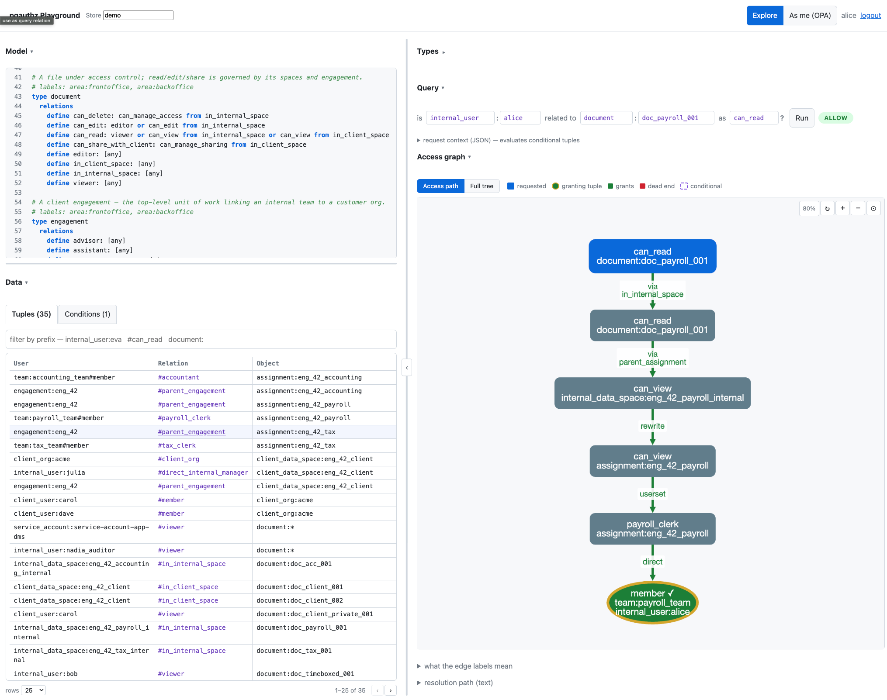

# pgauthz playground

An OpenFGA-playground-style UI for pgauthz: pick a store, run access queries, and
**visualize the resolution path** (`explain_access`) — running the real
production path end to end.



```
  Browser ──(session cookie)──▶ BFF (Go) ──(user's token)──▶ OPA ──▶ pgauthzd ──▶ engine
  Lit SPA                       auth-code + PKCE,            data.authz.{allow,  native
  (frontend/)                   sessions in pgauthz_playground  explain,...}     callback
```

(That's the Access Explorer's "As me" query path — the BFF calls the OPA policy
layer, which resolves the graph through pgauthzd's native `/pgauthz/v1` callback.
The AuthZEN tab instead goes through the `pgauthzd-opa` front door, which
consults OPA — the shape a production PEP uses.)

The BFF is a **backend-for-frontend**: the browser does OIDC authorization-code +
PKCE against Keycloak, the BFF holds the tokens **server-side** (sessions in a
separate `pgauthz_playground` DB) and exposes only an **http-only secure cookie**
to the SPA. Every query is forwarded with the session's access token, so it runs
**as the logged-in user** — the way a real PEP evaluates a request (in
production the PEP calls pgauthzd, the front door, which consults OPA).

## Run

```bash
./keycloak/config/generate-mkcerts.sh           # once (TLS for *.pgauthz.test)
./start.sh --playground                          # implies --keycloak; builds the BFF
(cd keycloak/terraform && terraform apply)       # provisions the playground-bff client
# /etc/hosts: 127.0.0.1 app.pgauthz.test
open https://app.pgauthz.test
```

Sign in as any demo user (`alice` / `bob` / `carol` / `eva`, password `password`).

## What you can do

Three **perspectives** (tab strip below the header); the store is selected via
the header combobox or **`?store=`** in the URL
(e.g. `https://app.pgauthz.test/?store=demo`):

- **Model Explorer** — the schema view. Left: the **model**
  (`describe_model` DSL, with type labels). Right: the **type graph**, with a
  **model / data** toggle — `model` renders the declared type restrictions
  (every direct relation, matching the DSL; userset restrictions like
  `team#member` are dashed, see the legend), `data` renders the type→type
  edges actually observed in the tuples.
- **Access Explorer** — the runtime view. Left: the store's **tuples** and
  **conditions**. Right: query the graph:
  - **Structured english**: `is internal_user:alice related to document:doc_payroll_001 as can_read?`
    with autocomplete on every field.
  - → **ALLOW/DENY** + a **Cytoscape access graph** of the resolution path
    (green = allowed step, red = denied), with the text tree as a detail —
    including the exact granting tuple (`matched_tuple`).
  - Two evaluation modes (toggle in the Query header):
    **Explore** (default) — **engine-direct**, read-only, **any subject** (the
    OpenFGA-playground style); **As me (OPA)** — query as the logged-in user via
    the OPA policy layer (which resolves the graph through pgauthzd's native
    callback), the subject taken from your token — the PEP evaluation path a
    production deployment fronts with pgauthzd.
- **AuthZEN** — an [AuthZEN 1.0](https://openid.net/specs/authorization-api-1_0.html)
  API console driving the real `pgauthzd-opa` service through the BFF (your
  session token is injected server-side). Endpoint picker (evaluation,
  evaluations, subject/resource/action search, discovery), a templated request
  built from the shared query fields (left), and the response (right). The
  search endpoints are disabled without the `authzen_auditor` role (they
  enumerate the access graph; see `SEARCH_REQUIRED_ROLE`).

Inputs autocomplete from the engine (`/api/meta/{stores,relations,objects,subjects}`,
a read-only metadata connection). Graphs zoom with **Ctrl/⌘ + scroll** (or
trackpad pinch) about the cursor and export as **Graphviz DOT** (⧉).

## Structure

```
playground/
  backend/                   # Go backend-for-frontend
    cmd/playground/          #   main: wiring (config, db, discovery, routes)
    internal/config/         #   env-driven configuration
    internal/oidc/           #   OIDC discovery + token exchange
    internal/server/         #   HTTP layer: sessions, auth, query, meta, explore, static
    go.mod  Dockerfile
  frontend/                  # Lit SPA (no build step — Lit from a CDN)
    index.html  styles.css   # styles.css holds the design tokens
    src/
      api.js                 # thin BFF client
      components/            # custom Lit web components
        pg-app.js            #   root: perspectives (model/explorer/authzen), store, query
        pg-model.js          #   model (describe_model) view
        pg-grid.js           #   generic data grid (used by tuples + conditions)
        pg-tuples.js         #   tuples grid
        pg-conditions.js     #   conditions grid
        pg-graph.js          #   shared Cytoscape base (zoom, fit, DOT export)
        pg-types-graph.js    #   type graph (model/data modes, legend)
        pg-access-graph.js   #   access graph (resolution path)
        pg-explain-tree.js   #   resolution-tree text view
        pg-authzen.js        #   AuthZEN API console
        pg-json-editor.js    #   JSON editor (highlighting, Format, read-only mode)
        pg-combo.js          #   combobox with autocomplete
  proxy.conf                 # app.pgauthz.test → BFF (added to the nginx proxy)
compose-playground.yml       # playground-db (sessions) + playground-bff
keycloak/terraform/client.playground.tf   # the confidential auth-code+PKCE client
```

## Developing

The SPA is **volume-mounted** and served statically with **no bundler** — edit
anything under `frontend/` and **reload the browser** (hard-reload if cached). Only Go
(`backend/`) changes need a rebuild: `docker compose … build playground-bff`.

Styling is structured with **design tokens** (`frontend/styles.css` `:root`): primitive
tokens (palette, spacing, radii, type) → semantic tokens (`--pg-allow-fg`, …).
Components — including the shadow-DOM `pg-explain-tree` — consume the semantic
tokens, and dark mode is a token override.

## Security notes (demo)

Demo-grade: dev client secret (`playground-bff-demo-secret`); the BFF session
cookie is http-only + `Secure` (served via the TLS proxy); the SPA never
receives a token. The metadata/explore connection uses the dedicated read-only
`authz_metadata` role (`ENGINE_DSN`), not the engine superuser. The AuthZEN
console proxies to `pgauthzd-opa` (`AUTHZEN_URL`; empty hides the tab) with the
session token injected server-side; its reverse-search endpoints are role-gated
(`SEARCH_REQUIRED_ROLE` on pgauthzd-opa, mirrored in the UI via
`PLAYGROUND_SEARCH_ROLE` → `/api/me.search_enabled`). Not for production as-is.
